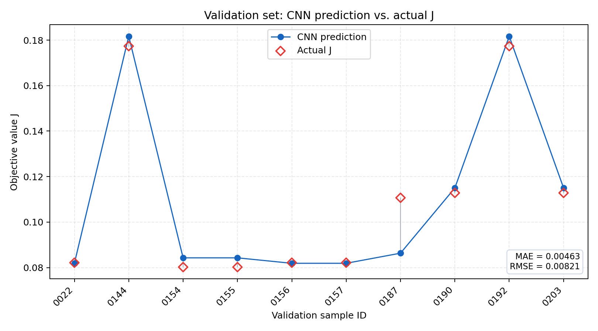

# 【已废弃基线】6×1 Conv1D 单目标 J 流程验证报告

> 此模型没有对结构图进行卷积，只对六个统计摘要做 Conv1D。它不能代表 FEM 结构 CNN，已由 `cnn_structure_validation/` 中的三通道材料拓扑 Conv2D 替代。

## 结论

数据构建、无泄漏分组、网络前向/反向传播、小样本过拟合、完整训练、模型保存、重新加载推理和验证集绘图均已跑通。

本实验仅验证流程，不用于证明模型泛化能力。

## 数据

- 有效 FEM–MAT 优化结果：42组。
- 训练集：32组，17个 `geometry_id`，16个唯一六维输入。
- 验证集：10组，5个 `geometry_id`，5个唯一六维输入。
- 验证集固定保留10条。
- 几何 ID、完整 `best_bits` 拓扑哈希、六维特征向量在训练/验证之间均无交叉。
- 标签：MAT 中的 `bestOverall`，即目标函数 J。

六维输入 `material_summary_v1`：

1. `air_fraction`
2. `iron_fraction`
3. `copper_fraction`
4. `radial_transition_rate`
5. `angular_transition_rate`
6. `t_min`

前三项表示材料占比；第四、第五项表示材料在径向/周向相邻网格间的变化比例；第六项为平均转矩约束阈值。

## 网络

```text
Input [B,1,6]
→ Conv1D(1,16,kernel=3)
→ ReLU
→ MaxPool1D(kernel=2,stride=2)
→ Flatten [B,32]
→ Dense(384)
→ ReLU
→ Dense(1)
```

可训练参数：13,121。

## 小样本过拟合测试

使用8条训练样本：

- RMSE：0.00000441
- MAE：0.00000317
- R²：0.99999999

网络可以记住小样本，说明数据读取、标签缩放、反向传播和模型保存链路正常。

## 32/10完整训练

- 完成 epoch：1,121
- 最佳 epoch：621
- 训练 RMSE：0.008881
- 训练 MAE：0.008718
- 训练 R²：0.999366
- 验证 RMSE：0.008209
- 验证 MAE：0.004635
- 验证 R²：0.948900

这些指标只代表当前固定划分上的流程输出。验证集虽然有10条记录，但仅对应5个唯一输入/几何组，因此不能据此评价真实泛化性能。

## 验证集对比图



红色空心菱形为实际 J，蓝色圆点为预测 J，灰色竖线为绝对误差。

## 主要输出

- `cnn_dataset.csv`：42条训练清单和32/10划分。
- `split_info.json`：分组、唯一输入数量和泄漏检查。
- `full/model.pt`：最佳模型及标准化参数。
- `full/metrics.json`：完整指标。
- `full/predictions.csv`：训练/验证逐条预测。
- `full/training_history.csv`：每个 epoch 的损失。
- `full/loss_curve.png`：训练曲线。
- `full/prediction_scatter.png`：实际值—预测值散点图。
- `full/validation_comparison.png` / `.svg`：验证集逐样本对比图。

## 限制

- 六维材料摘要会丢失大量空间几何信息，只适用于流程验证。
- 数据中存在重复运行；即使分组无泄漏，独立设计数量仍然很少。
- 13,121个参数远多于独立输入数量，容易过拟合。
- 后续正式模型应改用完整45/180位拓扑或二维材料栅格，并增加独立设计数量。
