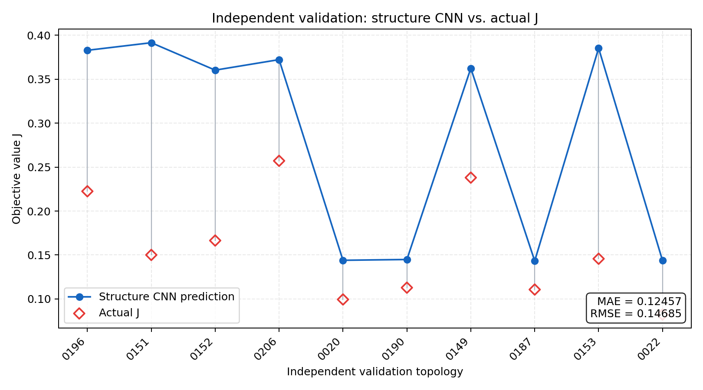

# FEM材料结构图 CNN 流程验证报告

## 修正结论

旧的6×1模型只卷积六个统计特征，不能识别具体结构，已标记为废弃基线。

当前模型直接从 FEM 文件重建二维材料布局，再执行 Conv2D。MAT 仅用于读取目标 `bestOverall=J` 和条件 `T_min`。

## FEM输入构建

42组配对 FEM 的坐标范围均为 `[0,0]–[74,74]`。解析过程：

1. 读取 FEM 节点、直线段和圆弧。
2. 将圆弧离散为几何线段。
3. 重建封闭区域。
4. 用 block label 为区域赋材料。
5. 在固定96×96像素中心采样材料。
6. 转换为五通道 one-hot。

输入张量：

```text
[batch, 5, 96, 96]

channel 0 = Background
channel 1 = Air
channel 2 = Iron/Steel
channel 3 = Copper
channel 4 = Magnet/N40/NdFeB
```

`T_min` 作为独立的 `[batch,1]` 数值输入，不写入图像。

现有 PNG 没有用于训练：部分是无效的1×1占位图，部分包含磁力线等求解后信息，使用它们会造成标签泄漏。

## 独立样本与划分

- 原始优化结果配对：42条。
- 一个旧格式 FEM 有60个多材料标签冲突区域，按质量规则排除。
- 按完整 FEM 材料栅格和 `T_min` 去重：21个可靠独立结构/条件。
- 训练：11个独立结构。
- 验证：10个独立结构。
- 训练与验证的 FEM 栅格哈希无交叉。

被排除的冲突栅格曾表现为一个额外“独立结构”；质量检查后，可靠 FEM 结构数与 MAT 粗拓扑的21个独立设计一致。

## 网络

```text
FEM image [B,5,96,96]
→ Conv2D(5→16, kernel=3×3, padding=1)
→ ReLU
→ MaxPool2D(2×2)
→ AdaptiveAvgPool2D(4×4)
→ Flatten [B,256]
                    ┐
T_min [B,1] ────────┴→ Dense(384) → ReLU → Dense(1)
```

可训练参数：100,193。

## 结果

5样本过拟合测试：

- RMSE：0.00000371
- MAE：0.00000302
- R²：0.99999999

11训练/10验证（以验证损失早停）：

- 最佳 epoch：3
- 训练 RMSE：0.52944
- 训练 MAE：0.21194
- 训练 R²：0.17280
- 验证 RMSE：0.14685
- 验证 MAE：0.12457
- 验证 R²：−5.31561

流程已经正确跑通，但模型没有泛化能力。训练继续拟合时验证损失立即恶化，因此早停选择了第3个 epoch；这与5样本可以完全记忆形成鲜明对比，是严重小样本过拟合的直接证据。当前只有11个独立训练结构，而模型有100,193个参数。

## 验证对比图



## 下一步

1. 增加独立 FEM 结构，不能只复制相同优化结果。
2. 在数据仍很少时，将 Dense(384) 缩小到16～32，并减少卷积通道。
3. 使用按拓扑分组的交叉验证。
4. 继续保留 `T_min` 作为条件输入。
5. 训练数据足够后再评价结构 CNN 的真实预测能力。
