# 电机拓扑平均转矩回归：三种神经网络模型与预测结果

> 汇报版本：2026-08-09  
> 任务：由离散电机拓扑预测六角度平均转矩  
> 数据规模：1,300 个已完成 FEMM 计算的唯一拓扑  
> 结果目录：`outputs/motor_regression_mean_torque_1300_rebalanced`

## 1. 结论摘要

本次保持转矩波动实验的数据、拓扑家族划分和训练规则不变，仅将单一监督标签由转矩波动率 `t_ripple` 替换为平均转矩 `t_avg`，重新训练 ResNet-20、MLP 和 Small CNN。

在 210 个未见拓扑家族测试样本上，**MLP 的平均转矩预测最好**：

| 模型 | 参数量 | 测试 MAE | 测试 RMSE | 测试 R² |
|---|---:|---:|---:|---:|
| ResNet-20 | 333,393 | 0.0543 Nm | 0.0789 Nm | 0.9321 |
| **MLP** | **171,521** | **0.0316 Nm** | **0.0480 Nm** | **0.9748** |
| Small CNN | 118,049 | 0.0415 Nm | 0.0611 Nm | 0.9593 |

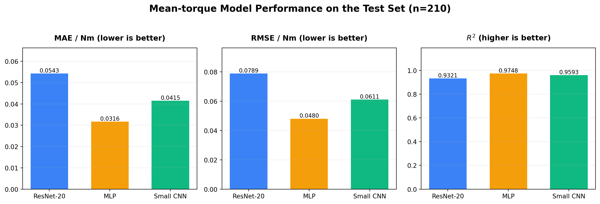

平均转矩比转矩波动率更容易预测：三个模型的测试 R² 均超过 0.93。当前结果说明，平均转矩与材料在固定网格位置上的全局组合关系很强，MLP 已能有效学习这种映射；更深的 ResNet-20 在现有数据量下没有取得优势。

## 2. 模型输入与输出

### 2.1 输入

每个样本由 180 位离散染色体组成，并按照数据库中的真实方向恢复为：

```text
18 个径向单元 × 10 个角向单元 = [18,10]
```

材料编码为：

| 基因值 | 材料 | One-hot 通道 |
|---:|---|---:|
| 0 | Air，空气 | 0 |
| 1 | Iron，铁磁材料 | 1 |
| 2 | Copper，铜 | 2 |

离散材料转换为 one-hot 后，模型实际输入为：

```text
单个样本：[3,18,10]
一个批次：[B,3,18,10]
```

不对输入执行 resize、插值、随机裁剪、翻转或颜色增强。宽度方向循环填充接口保留，但本次关闭。

### 2.2 输出

每个拓扑在以下六个机械角度完成 FEMM 求解：

```text
[0°, 3°, 6°, 9°, 12°, 15°]
```

设六个电磁转矩为 \(T_1,\ldots,T_6\)，本任务的监督输出为：

\[
T_{avg}=\frac{1}{6}\sum_{i=1}^{6}T_i
\]

单位为 Nm。三个模型的最后一层均输出一个连续值：

```text
网络输出：[B,1] = 标准化平均转矩
反标准化：[B,1] = 平均转矩预测值，单位 Nm
```

本模型不输出转矩波动率，也不输出历史目标函数 \(J\)。转矩波动模型保存在平行目录 `showoutput/torque_ripple/`。

### 2.3 训练目标标准化

只使用训练集计算目标统计量：

\[
z=\frac{T_{avg}-\mu_{train}}{\sigma_{train}}
\]

```text
μ_train = 0.3349482633 Nm
σ_train = 0.3089614838 Nm
```

训练损失在标准化空间中计算；预测 CSV、图表与最终指标使用反标准化后的 Nm 数值。

## 3. 数据审计和划分

### 3.1 平均转矩数据

| 项目 | 结果 |
|---|---:|
| 总样本数 | 1,300 |
| 唯一染色体 | 1,300 |
| 重复染色体 | 0 |
| 缺失或非有限平均转矩 | 0 |
| 最小平均转矩 | 0.00051 Nm |
| 最大平均转矩 | 0.88713 Nm |
| 全库均值 | 0.35228 Nm |
| 全库中位数 | 0.25253 Nm |
| 全库标准差 | 0.30731 Nm |

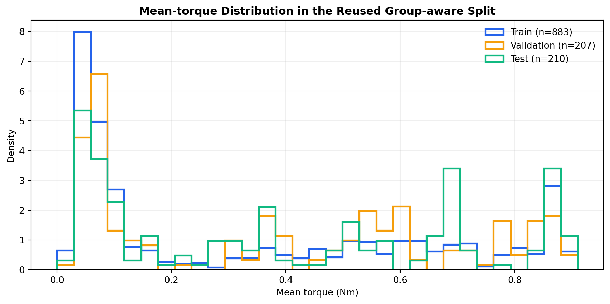

### 3.2 与转矩波动模型完全相同的划分

平均转矩训练直接读取并验证转矩波动实验的 `data_split.json`，按照样本键复用原划分：

| 数据集 | 样本数 | 拓扑家族数 | 平均转矩均值 | 平均转矩标准差 |
|---|---:|---:|---:|---:|
| 训练集 | 883 | 450 | 0.33495 Nm | 0.30896 Nm |
| 验证集 | 207 | 34 | 0.38312 Nm | 0.29810 Nm |
| 测试集 | 210 | 38 | 0.39477 Nm | 0.30275 Nm |

同一拓扑家族不会跨越训练、验证和测试集合，三个集合的家族交集为 0。这样既防止近亲拓扑泄漏，也使平均转矩结果与转矩波动结果能够在相同样本基础上平行分析。

## 4. 三个模型架构

三个模型与转矩波动实验的架构完全一致，只替换训练标签并重新训练全部权重。

### 4.1 ResNet-20

| 阶段 | 结构 | 输出张量 |
|---|---|---|
| Input | 三通道材料 one-hot | `[B,3,18,10]` |
| Stem | 3×3 Conv 3→16 + BN + ReLU | `[B,16,18,10]` |
| Stage 1 | 3 个 BasicBlock，16 通道，不降采样 | `[B,16,18,10]` |
| Stage 2 | 3 个 BasicBlock，首块 stride=2，16→32 | `[B,32,9,5]` |
| Stage 3 | 3 个 BasicBlock，首块 stride=2，32→64 | `[B,64,5,3]` |
| Flatten | 64×5×3 | `[B,960]` |
| 回归头 | Linear 960→64 + ReLU | `[B,64]` |
| Output | Linear 64→1 | `[B,1]` |

每个 BasicBlock 的主分支包含两个 3×3 卷积；尺寸或通道变化时，shortcut 使用 1×1、stride=2 卷积和 BN 投影。参数量为 **333,393**。

### 4.2 MLP

| 阶段 | 结构 | 输出张量 |
|---|---|---|
| Input | 三通道材料 one-hot | `[B,3,18,10]` |
| Flatten | 3×18×10 | `[B,540]` |
| Hidden 1 | Linear 540→256 + ReLU | `[B,256]` |
| Hidden 2 | Linear 256→128 + ReLU | `[B,128]` |
| Output | Linear 128→1 | `[B,1]` |

参数量为 **171,521**。MLP 没有卷积核和局部共享机制，每一个材料位置都作为固定的独立输入特征参与预测。

### 4.3 Small CNN

| 阶段 | 结构 | 输出张量 |
|---|---|---|
| Input | 三通道材料 one-hot | `[B,3,18,10]` |
| Conv 1 | 3×3 Conv 3→32 + BN + ReLU | `[B,32,18,10]` |
| Conv 2 | 3×3 Conv 32→64，stride=2 + BN + ReLU | `[B,64,9,5]` |
| Conv 3 | 3×3 Conv 64→64，stride=2 + BN + ReLU | `[B,64,5,3]` |
| Flatten | 64×5×3 | `[B,960]` |
| 回归头 | Linear 960→64 + ReLU | `[B,64]` |
| Output | Linear 64→1 | `[B,1]` |

参数量为 **118,049**。它保留二维局部材料结构，同时比 ResNet-20 更紧凑。

## 5. 训练配置

| 项目 | 配置 |
|---|---|
| 优化器 | AdamW |
| 初始学习率 | 1×10⁻³ |
| Weight decay | 1×10⁻⁴ |
| Batch size | 32 |
| 损失函数 | MSELoss |
| 学习率调度 | ReduceLROnPlateau |
| 调度参数 | factor=0.5，patience=10，min_lr=1×10⁻⁶ |
| 最大 Epoch | 300 |
| Early stopping patience | 30 |
| Dropout | 0 |
| 随机种子 | 20260809 |

## 6. 预测结果

### 6.1 相同测试集的模型对比

横轴为 FEMM 计算得到的真实平均转矩，纵轴为预测值，虚线代表完全正确的预测。

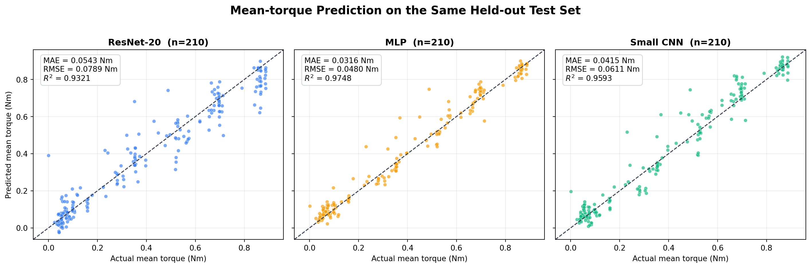

| 模型 | 最佳 Epoch | 实际训练 Epoch | 训练 MAE | 验证 MAE | 测试 MAE | 测试 RMSE | 测试 R² |
|---|---:|---:|---:|---:|---:|---:|---:|
| ResNet-20 | 94 | 124 | 0.0086 | 0.0577 | 0.0543 | 0.0789 | 0.9321 |
| **MLP** | **41** | **71** | **0.0039** | **0.0297** | **0.0316** | **0.0480** | **0.9748** |
| Small CNN | 26 | 56 | 0.0120 | 0.0341 | 0.0415 | 0.0611 | 0.9593 |

相对 ResNet-20，MLP 的测试 MAE 降低约 41.8%，RMSE 降低约 39.1%；相对 Small CNN，MLP 的测试 MAE 降低约 23.8%，RMSE 降低约 21.4%。

### 6.2 ResNet-20 预测、训练和残差

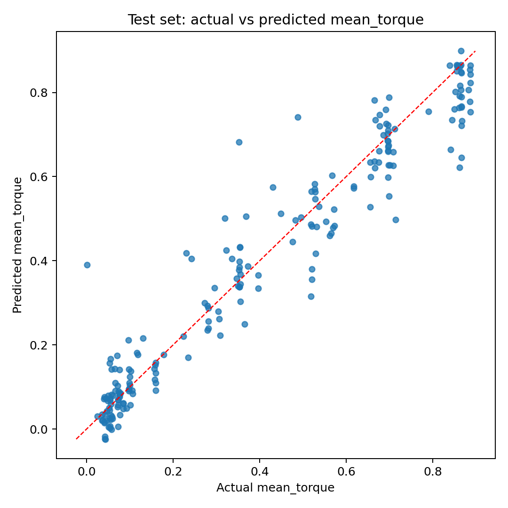

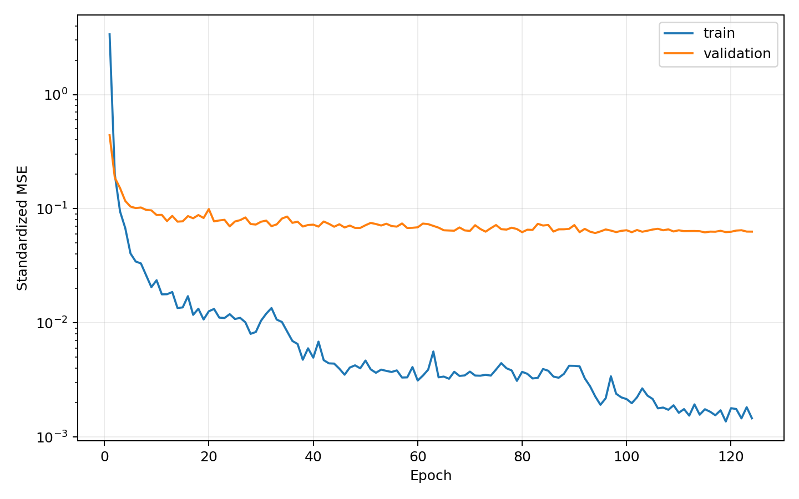

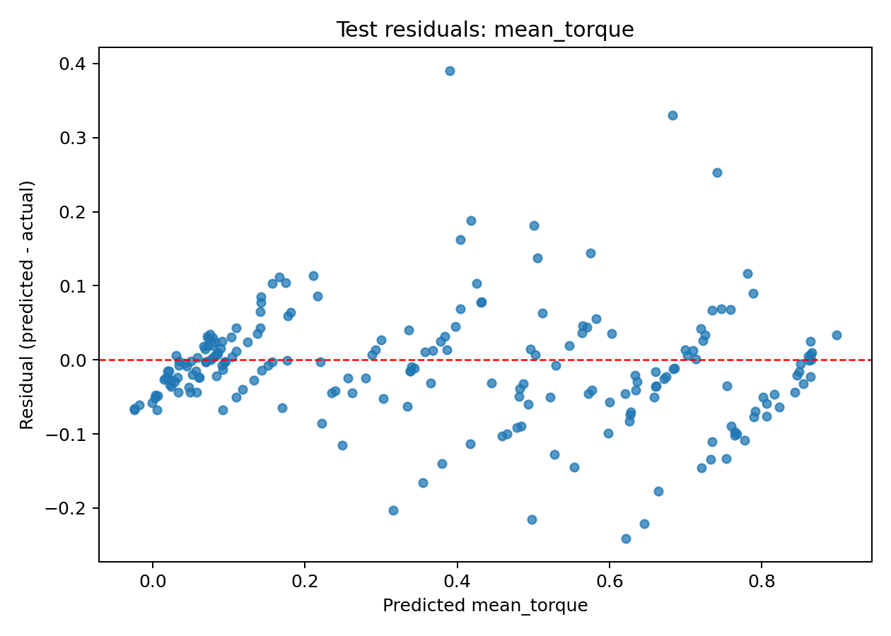

ResNet-20 能够学习整体转矩等级，但部分低转矩和中间转矩样本偏差较大。训练 MAE 远低于测试 MAE，表明深层模型对训练拓扑拟合充分，但仍存在明显泛化间隙。

### 6.3 MLP 预测、训练和残差

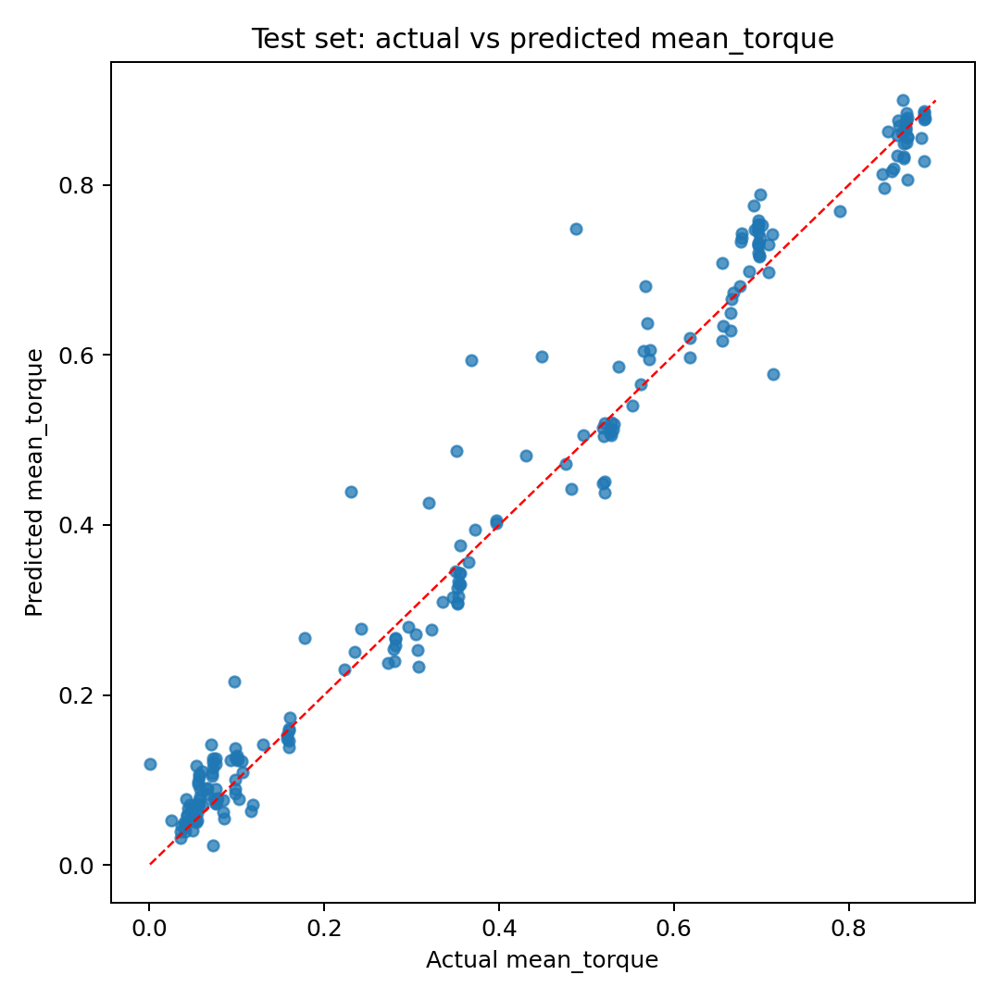

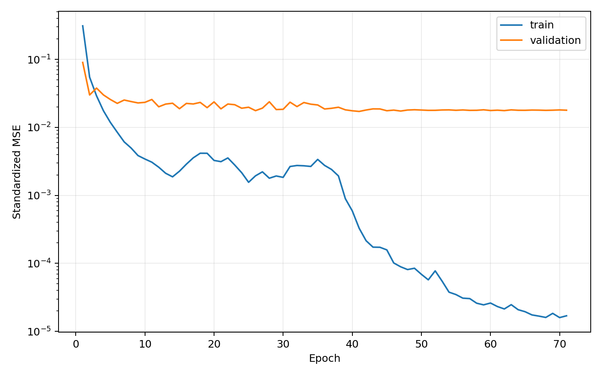

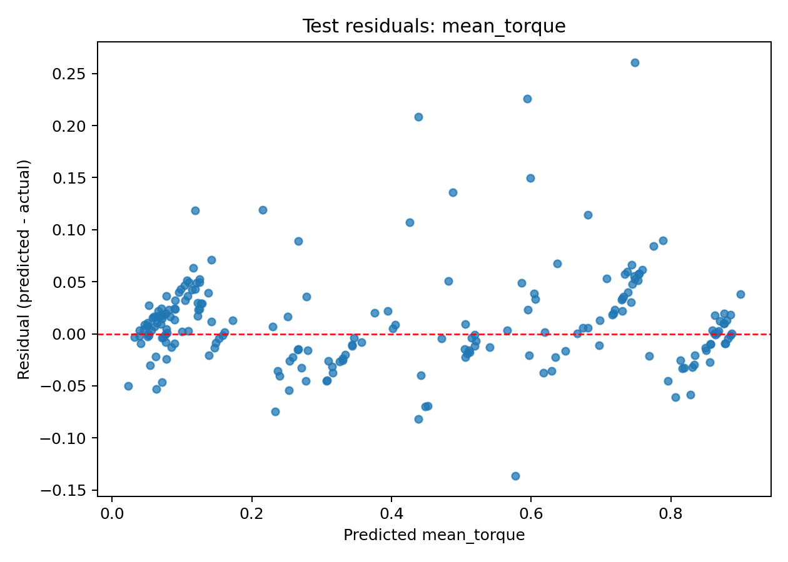

MLP 的大多数预测点紧贴理想对角线，只有少数中低转矩样本出现较大正偏差。它是本次平均转矩任务的最佳模型。

### 6.4 Small CNN 预测、训练和残差

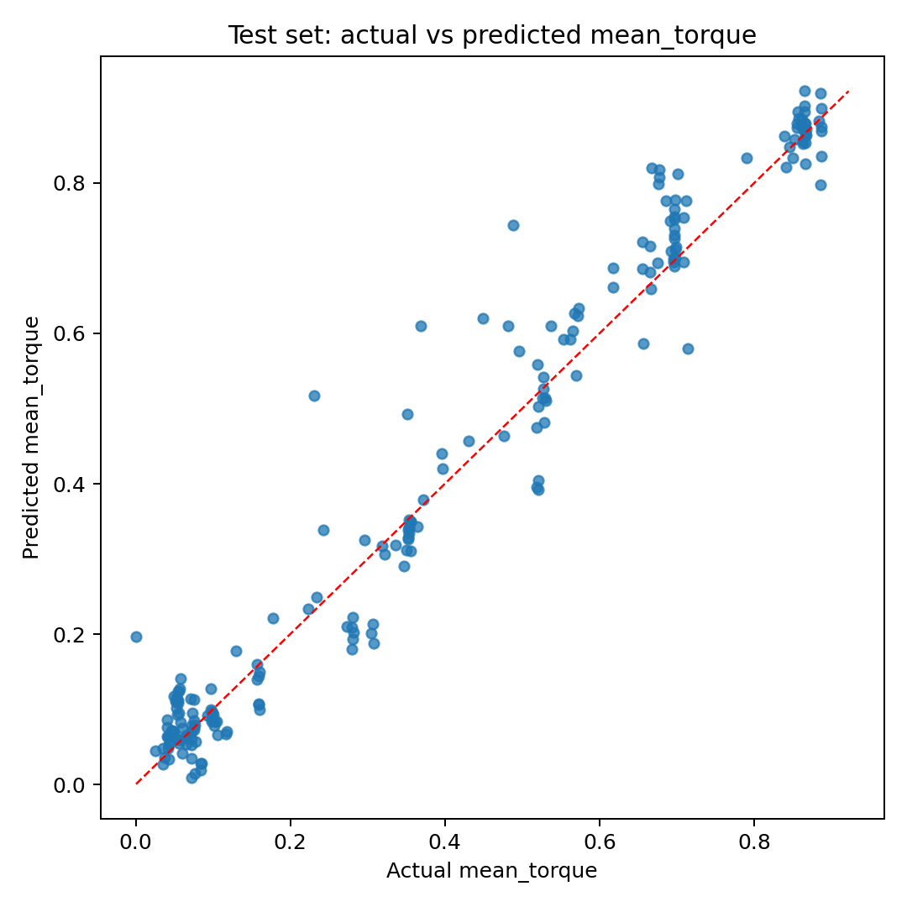

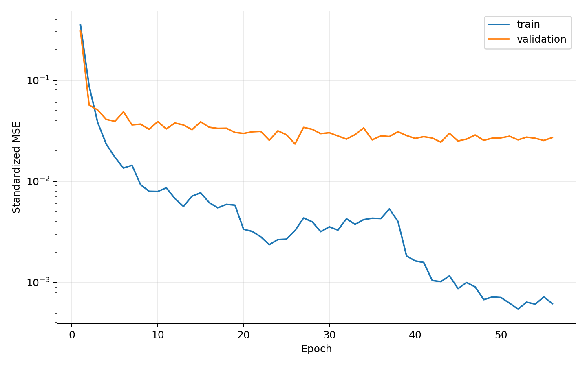

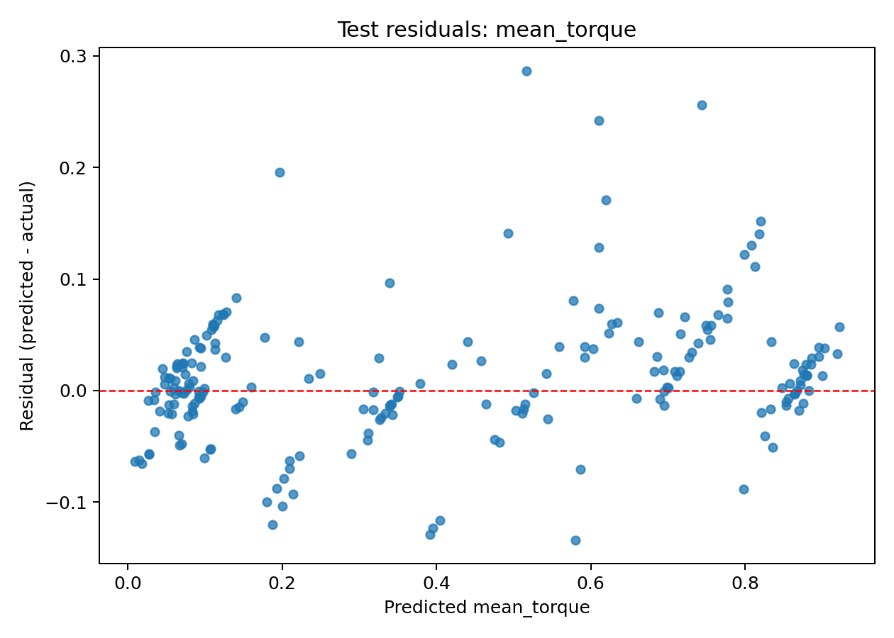

Small CNN 的结果明显优于 ResNet-20，但略逊于 MLP。它的优势是保留二维局部结构，并且参数量最少；若后续数据规模增大或拓扑模板发生局部变化，它仍是重要候选模型。

### 6.5 最佳 MLP 的分适应度带误差

| 适应度带 | 测试样本数 | MAE | RMSE |
|---|---:|---:|---:|
| B1 | 118 | 0.0300 Nm | 0.0461 Nm |
| B2 | 11 | 0.0641 Nm | 0.0994 Nm |
| B3 | 14 | 0.0311 Nm | 0.0422 Nm |
| B4 | 19 | 0.0357 Nm | 0.0433 Nm |
| B5 | 15 | 0.0452 Nm | 0.0550 Nm |
| B6 | 26 | 0.0192 Nm | 0.0240 Nm |
| B7 | 7 | 0.0158 Nm | 0.0249 Nm |

B2 的误差最大，是平均转矩任务后续补样本和分析异常点的优先区域。B7 只有 7 个测试样本，尽管当前绝对误差较小，仍不能据此作过强结论。

## 7. 为什么平均转矩任务中 MLP 最好

当前设计域位置固定，每个网格单元对应明确的径向和角向位置。平均转矩是六个角度结果的平均值，局部峰谷被平滑，因此它与全局材料数量、材料所在固定位置及其组合关系通常更加稳定。

MLP 直接保留 540 个 one-hot 位置特征的独立权重，能够有效拟合这种“固定位置到全局平均性能”的映射。相比之下：

- ResNet-20 参数更多，在 883 个训练样本上更容易学习到训练家族的细节；
- Small CNN 的卷积共享假设更强调相同局部模式在不同位置具有相近意义，但电机设计域不同径向位置的物理作用不完全等价；
- MLP 对绝对位置敏感，正好适合当前固定设计域，因此在该数据集上取得最好结果。

这并不意味着 MLP 在所有后续数据上必然最好。如果设计域尺寸、材料模板或坐标意义改变，MLP 的位置依赖可能降低迁移能力，需要重新评价三种模型。

## 8. 科学边界

1. 平均转矩由历史兼容的六角度结果求平均，尚未与更密角度扫描的平均值系统比较。
2. 数据来自 GA 和约束感知采样，并非对全部物理可行空间均匀采样。
3. 模型只在当前 18×10 编码、材料定义、几何构建模式和 FEMM 设置下验证。
4. 虽然使用拓扑家族分组降低了近亲泄漏风险，但测试集仍只有 38 个家族、210 个样本。
5. 当前平均转矩和转矩波动率分别训练，不能只加载一个 checkpoint 同时得到两个结果。

## 9. 输出文件

平均转矩训练结果保存在：

```text
outputs/motor_regression_mean_torque_1300_rebalanced/
```

其中每个模型目录包含：

- `best_checkpoint.pt`：验证集最优 PyTorch 权重；
- `predictions.csv`：训练、验证、测试样本的真实值、预测值和残差；
- `metrics.json`：总体及分适应度带指标；
- `training_history.csv`：逐 Epoch 损失和学习率；
- 预测图、残差图与训练曲线。

完整配置为：

```text
configs/motor_regression_mean_torque.yaml
```

## 10. 汇报时可使用的一段总结

> 在转矩波动率预测之外，我们使用完全相同的1,300个电机拓扑和完全相同的拓扑家族划分，建立了平行的平均转矩单输出回归模型。输入仍为18×10的空气、铁和铜三通道one-hot矩阵，输出改为六个机械角度FEMM转矩的平均值。ResNet-20、MLP和Small CNN均从头重新训练。最终MLP在210个未见拓扑家族测试样本上取得最佳结果，MAE为0.0316 Nm、RMSE为0.0480 Nm、R²为0.9748。三个模型对平均转矩的预测都明显优于对转矩波动率的预测，说明平均转矩与固定材料布局之间的映射更加平滑稳定。后续应重点检查少数中低转矩异常点，并用更密角度扫描验证六点平均转矩标签。

