# 电机拓扑性能回归：三种神经网络模型与预测结果

> 汇报版本：2026-08-09  
> 任务：由离散电机拓扑预测转矩脉动率（torque ripple）  
> 数据规模：1,300 个已完成六角度 FEMM 计算的唯一拓扑  
> 本报告采用结果目录：`outputs/motor_regression_ripple_1300_rebalanced`

## 1. 结论摘要

本阶段使用完全相同的数据划分，训练并比较了三种回归模型：CIFAR-style ResNet-20、MLP 和普通 Small CNN。

在严格保留拓扑家族边界的 210 个测试样本上，**Small CNN 表现最好**：

| 模型 | 参数量 | 测试 MAE | 测试 RMSE | 测试 R² |
|---|---:|---:|---:|---:|
| ResNet-20 | 333,393 | 0.1231 | 0.2092 | 0.6261 |
| MLP | 171,521 | 0.1132 | 0.1970 | 0.6682 |
| **Small CNN** | **118,049** | **0.0845** | **0.1381** | **0.8370** |

这说明在当前约 1,300 个样本的规模下，更紧凑的二维卷积网络比更深的 ResNet-20 泛化得更好。ResNet-20 训练误差很低，但测试误差明显增大，当前数据量尚不足以充分发挥较深模型的容量。

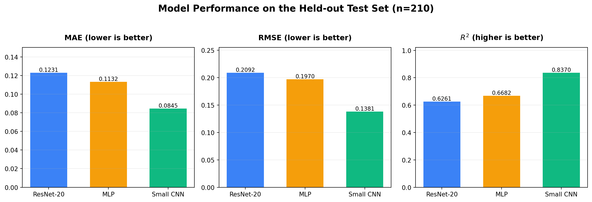

## 2. 问题定义

### 2.1 原始输入

每个电机拓扑由 180 位离散染色体表示。每个基因对应设计域中的一个材料单元：

| 基因值 | 材料 |
|---:|---|
| 0 | Air，空气 |
| 1 | Iron，铁磁材料 |
| 2 | Copper，铜 |

数据库中实际保存的材料矩阵为：

```text
[18, 10] = 18 个径向单元 × 10 个角向单元
```

这里采用实际数据库方向，不进行转置、缩放或插值。早期方案中出现过“10×18”的表述，但数据审计确认网络真正读取的是 **18×10**。

### 2.2 One-hot 输入

材料编号只是类别标识，数值 2 并不代表铜是空气的“两倍”。因此不能直接把 0、1、2 当成连续灰度值，而是转换为三个独立通道：

```text
原始单样本：       [18, 10]
One-hot 单样本：   [3, 18, 10]
批量网络输入：     [B, 3, 18, 10]
```

三个通道分别表示空气、铁和铜。任意网格位置只有一个通道为 1，其余两个通道为 0。

### 2.3 监督标签

当前第一阶段只预测一个连续标量：六角度 FEMM 结果计算出的转矩脉动率 `t_ripple`。

六个机械角度为：

```text
[0°, 3°, 6°, 9°, 12°, 15°]
```

设六个转矩结果为 \(T_1,\ldots,T_6\)，则：

\[
T_{avg}=\frac{1}{6}\sum_{i=1}^{6}T_i
\]

\[
T_{ripple}=\frac{T_{max}-T_{min}}{\max\left(|T_{avg}|,10^{-6}\right)}
\]

模型训练目标是无量纲的 \(T_{ripple}\)，不是历史目标函数 \(J\)，也不是平均转矩 \(T_{avg}\)。项目已经保留多输出配置接口，后续可以把 `t_avg` 等字段加入 `targets`，将最后一层从 1 个神经元扩展为多个神经元。

### 2.4 目标标准化与最终输出

目标值只使用训练集统计量标准化，避免验证集或测试集信息泄漏：

\[
z=\frac{T_{ripple}-\mu_{train}}{\sigma_{train}}
\]

本次训练使用：

```text
训练集均值 μ_train = 0.2139081168
训练集标准差 σ_train = 0.3424253462
```

网络内部输出一个标准化标量 `[B,1]`；保存预测 CSV 和计算 MAE、RMSE、R² 前，会反标准化回原始转矩脉动率尺度。

## 3. 数据集与划分方法

### 3.1 数据审计结果

| 项目 | 结果 |
|---|---:|
| 总样本数 | 1,300 |
| 1000 样本主数据集 | 1,000 |
| 分段补充数据集 | 300 |
| 唯一染色体 | 1,300 |
| 重复染色体 | 0 |
| 材料类别 | 0、1、2 |
| 矩阵缺失值 | 0 |
| 未知材料单元 | 0 |
| 转矩脉动率范围 | 0.01036 ～ 3.64423 |
| 转矩脉动率中位数 | 0.11866 |
| 拓扑家族数 | 522 |

### 3.2 防止近亲拓扑泄漏

如果把同一个 GA 父本产生的相近后代随机分到训练集和测试集，测试结果可能虚高。为此，本次重新划分以 `topology_family` 为组，同一家族只能完整进入训练、验证或测试中的一个集合。

在满足拓扑家族隔离的前提下，同时平衡：

- B1～B7 适应度带分布；
- 转矩脉动率的 10 个分位区间；
- 训练、验证、测试的样本比例。

最终划分如下：

| 数据集 | 样本数 | 拓扑家族数 | 用途 |
|---|---:|---:|---|
| 训练集 | 883 | 450 | 更新模型参数 |
| 验证集 | 207 | 34 | 学习率调度、早停和最佳模型选择 |
| 测试集 | 210 | 38 | 仅用于最终泛化能力评价 |

三个集合的拓扑家族交集均为 0，三个模型使用完全相同的样本划分。

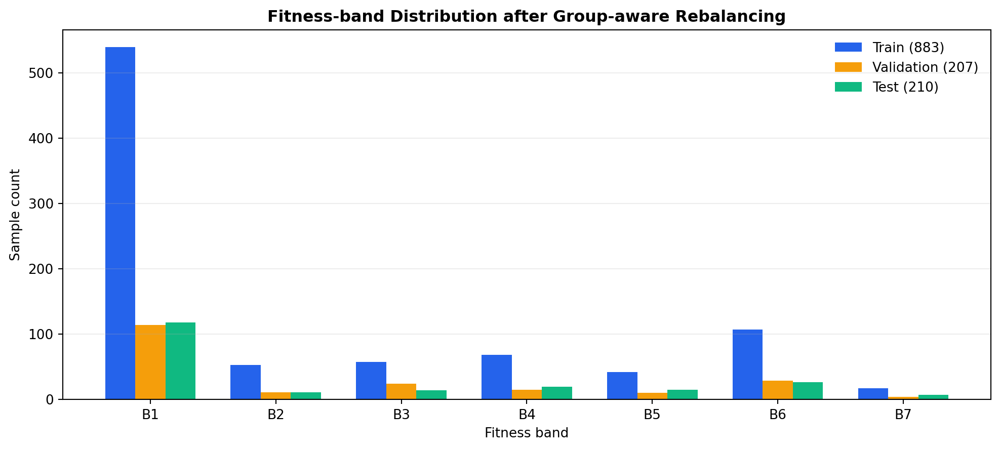

需要注意，B1 仍占多数。这不是划分错误，而是完整数据库本身的真实分布：B1 共 771 个，B7 只有 28 个。分组约束下无法使每个集合完全等比例，尤其 B7 测试集只有 7 个样本。

## 4. 统一的数据流

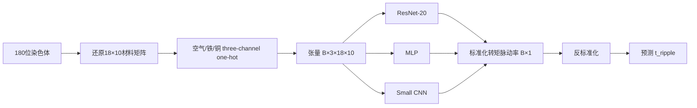

所有模型均不使用随机裁剪、翻转或自然图像颜色增强；默认不使用 Dropout；宽度方向循环填充接口保留，但本次训练关闭。

## 5. 三个模型的详细架构

### 5.1 CIFAR-style ResNet-20 回归模型

ResNet 的关键思想是让每个残差块学习输入的“修正量”而不是完全重新构造特征：

\[
y=\operatorname{ReLU}\left(F(x)+S(x)\right)
\]

其中 \(F(x)\) 是两层 3×3 卷积得到的残差，\(S(x)\) 是捷径分支。当空间尺寸和通道数不变时，\(S(x)=x\)；当进入新的 Stage 需要降采样时，捷径分支使用 1×1、stride=2 卷积和 BN 投影。

#### ResNet-20 主干

| 顺序 | 层/模块 | 关键配置 | 输出张量 |
|---:|---|---|---|
| 0 | Input | 三通道 one-hot | `[B,3,18,10]` |
| 1 | Stem Conv | 3×3，3→16，stride=1，padding=1，无 bias | `[B,16,18,10]` |
| 2 | BN + ReLU | 16 通道 | `[B,16,18,10]` |
| 3 | Stage 1 | 3 个 BasicBlock，16 通道，均不降采样 | `[B,16,18,10]` |
| 4 | Stage 2 | 3 个 BasicBlock；首块 16→32、stride=2 | `[B,32,9,5]` |
| 5 | Stage 3 | 3 个 BasicBlock；首块 32→64、stride=2 | `[B,64,5,3]` |
| 6 | Flatten | 64×5×3 | `[B,960]` |
| 7 | Linear + ReLU | 960→64 | `[B,64]` |
| 8 | Linear | 64→1 | `[B,1]` |

每个 BasicBlock 包含：

```text
3×3 Conv → BatchNorm → ReLU → 3×3 Conv → BatchNorm
           + shortcut
                         → ReLU
```

Stage 1、2、3 各有 3 个块，因此残差主分支共包含 18 个 3×3 卷积；加上最前面的 Stem 卷积，构成 CIFAR-style ResNet-20 的卷积主体。用于回归的末端不是 CIFAR 分类器，而是 `960→64→1` 全连接头。

最终特征写成 `[B,64,5,3]`，是因为真实输入方向为 18×10；若把空间轴写成 10×18 才会得到 3×5。两种写法的 Flatten 维数均为 960，但本项目必须以数据库确认的 18×10 为准。

**参数量：333,393，全部可训练。**

### 5.2 MLP 基线模型

MLP 不进行空间卷积。它先把三个材料通道全部展开为一维向量：

```text
3 × 18 × 10 = 540 个输入特征
```

| 顺序 | 层/模块 | 输出张量 |
|---:|---|---|
| 0 | Input | `[B,3,18,10]` |
| 1 | Flatten | `[B,540]` |
| 2 | Linear 540→256 + ReLU | `[B,256]` |
| 3 | Linear 256→128 + ReLU | `[B,128]` |
| 4 | Linear 128→1 | `[B,1]` |

**参数量：171,521，全部可训练。**

MLP 的作用是提供非卷积基线：它能学习每个位置和输出之间的非线性关系，但没有“相邻网格共享局部模式”的先验，也不具备卷积核的参数共享机制。

### 5.3 Small CNN 基线模型

Small CNN 保留二维局部结构，但显著减少网络深度。它用三层卷积完成两次降采样，然后使用与 ResNet 相同维数的回归头。

| 顺序 | 层/模块 | 关键配置 | 输出张量 |
|---:|---|---|---|
| 0 | Input | 三通道 one-hot | `[B,3,18,10]` |
| 1 | Conv + BN + ReLU | 3×3，3→32，stride=1 | `[B,32,18,10]` |
| 2 | Conv + BN + ReLU | 3×3，32→64，stride=2 | `[B,64,9,5]` |
| 3 | Conv + BN + ReLU | 3×3，64→64，stride=2 | `[B,64,5,3]` |
| 4 | Flatten | 64×5×3 | `[B,960]` |
| 5 | Linear + ReLU | 960→64 | `[B,64]` |
| 6 | Linear | 64→1 | `[B,1]` |

**参数量：118,049，全部可训练。**

Small CNN 比 ResNet-20 少约 64.6% 的参数，仍能直接识别材料边界、铜区形状、局部连接模式和相邻材料组合。在当前数据量下，这种容量与任务复杂度的匹配最好。

### 5.4 架构横向比较

| 特性 | ResNet-20 | MLP | Small CNN |
|---|---|---|---|
| 保留二维结构 | 是 | 否 | 是 |
| 使用卷积参数共享 | 是 | 否 | 是 |
| 残差连接 | 是 | 否 | 否 |
| 主体深度 | 1 个 Stem + 9 个残差块 | 3 个 Linear | 3 个 Conv + 2 个 Linear |
| 两次空间降采样 | 是 | 不适用 | 是 |
| 最终输出 | 1 个连续值 | 1 个连续值 | 1 个连续值 |
| 参数量 | 333,393 | 171,521 | 118,049 |
| 当前角色 | 主模型候选 | 非卷积基线 | **当前最佳模型** |

## 6. 统一训练配置

| 项目 | 配置 |
|---|---|
| 优化器 | AdamW |
| 初始学习率 | 1×10⁻³ |
| Weight decay | 1×10⁻⁴ |
| Batch size | 32 |
| 损失函数 | MSELoss（在标准化目标空间计算） |
| 学习率调度 | ReduceLROnPlateau |
| 调度参数 | factor=0.5，patience=10，min_lr=1×10⁻⁶ |
| 最大 Epoch | 300 |
| Early stopping patience | 30 |
| Dropout | 0 |
| 数据增强 | 无 |
| 循环宽度填充 | 关闭 |
| 随机种子 | 20260809 |

验证集决定最佳 checkpoint 和早停时刻；测试集不参与训练、调参或模型选择。

## 7. 预测结果

### 7.1 三模型统一测试集对比

下图中横轴是真实转矩脉动率，纵轴是模型预测值；虚线表示完全正确的 `prediction = actual`。点越贴近虚线，预测越准确。

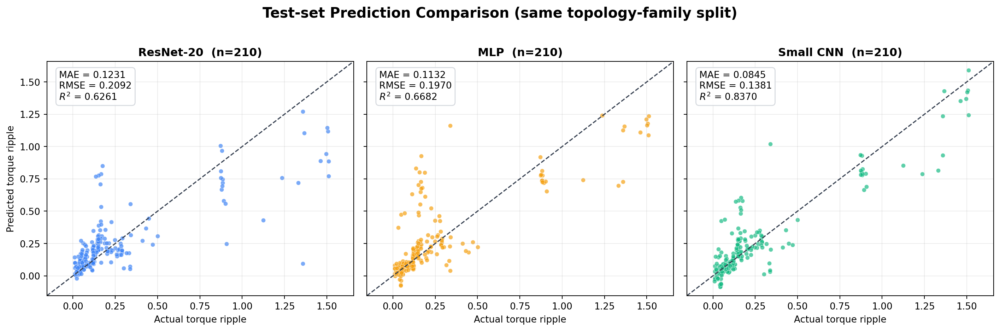

测试集结果表：

| 模型 | 最佳 Epoch | 实际训练 Epoch | MAE | RMSE | R² |
|---|---:|---:|---:|---:|---:|
| ResNet-20 | 19 | 49 | 0.1231 | 0.2092 | 0.6261 |
| MLP | 24 | 54 | 0.1132 | 0.1970 | 0.6682 |
| **Small CNN** | **16** | **46** | **0.0845** | **0.1381** | **0.8370** |

与 ResNet-20 相比，Small CNN 的测试 MAE 降低约 31.4%，RMSE 降低约 34.0%；与 MLP 相比，测试 MAE 降低约 25.4%，RMSE 降低约 29.9%。

### 7.2 ResNet-20

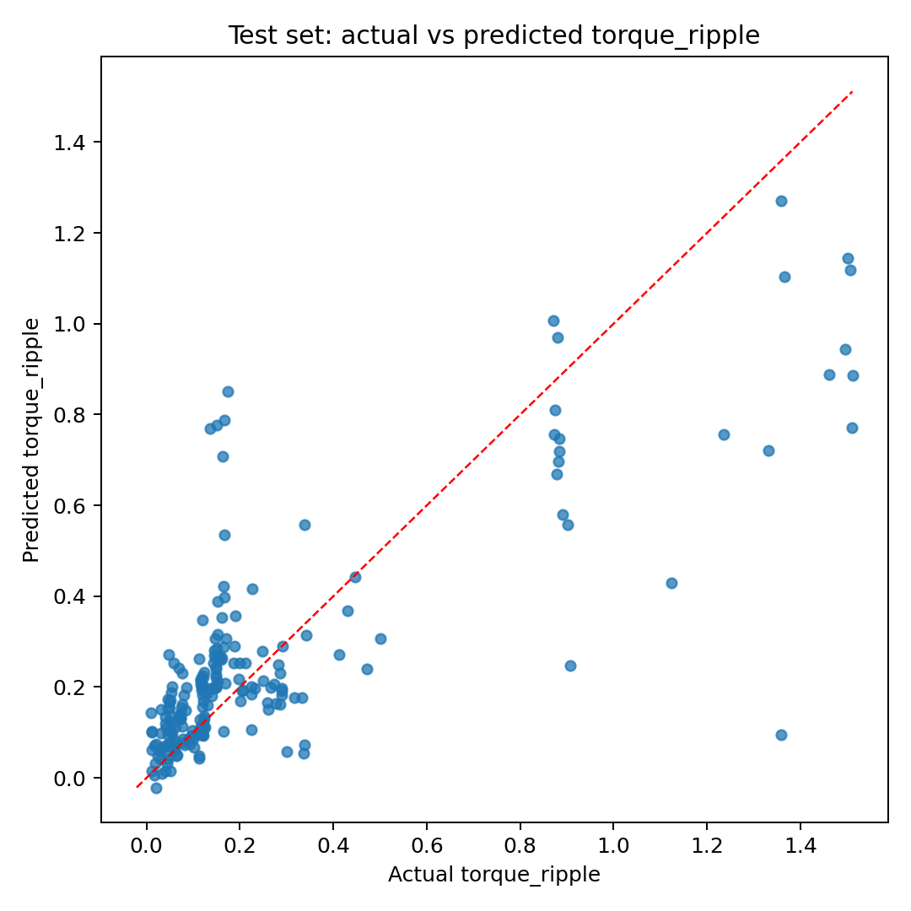

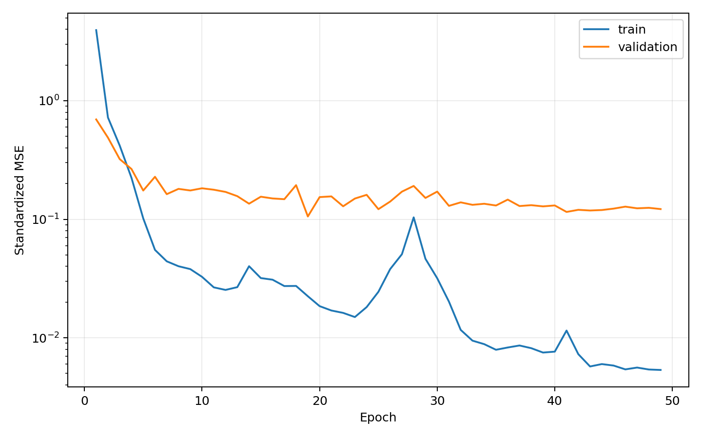

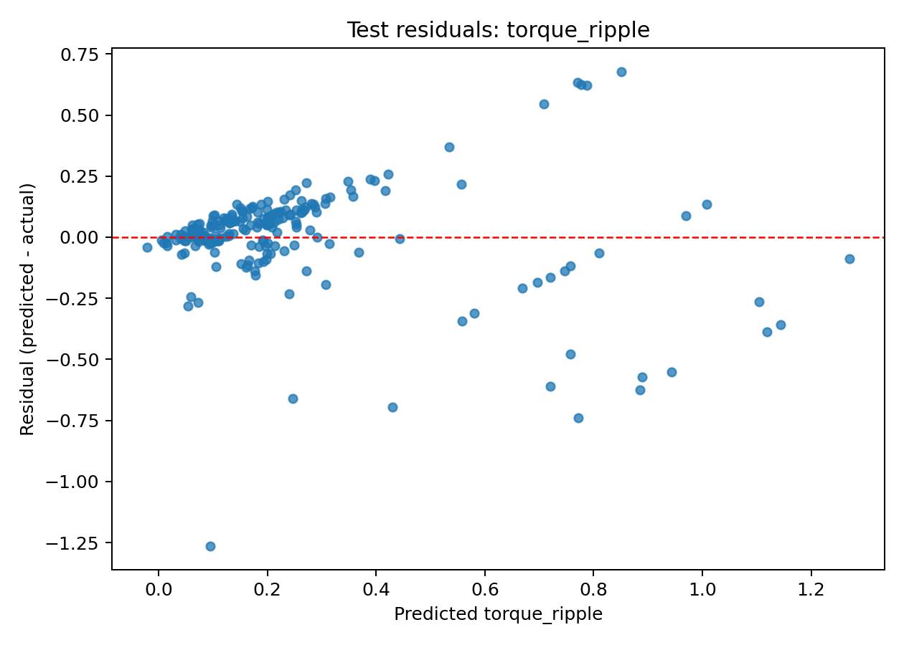

ResNet-20 的训练集 MAE 为 0.0237、测试集 MAE 为 0.1231。较大的训练—测试差距表明模型已很好地拟合训练拓扑，但对未见拓扑家族的泛化仍受数据规模限制。散点图中部分高脉动样本被明显低估。

### 7.3 MLP

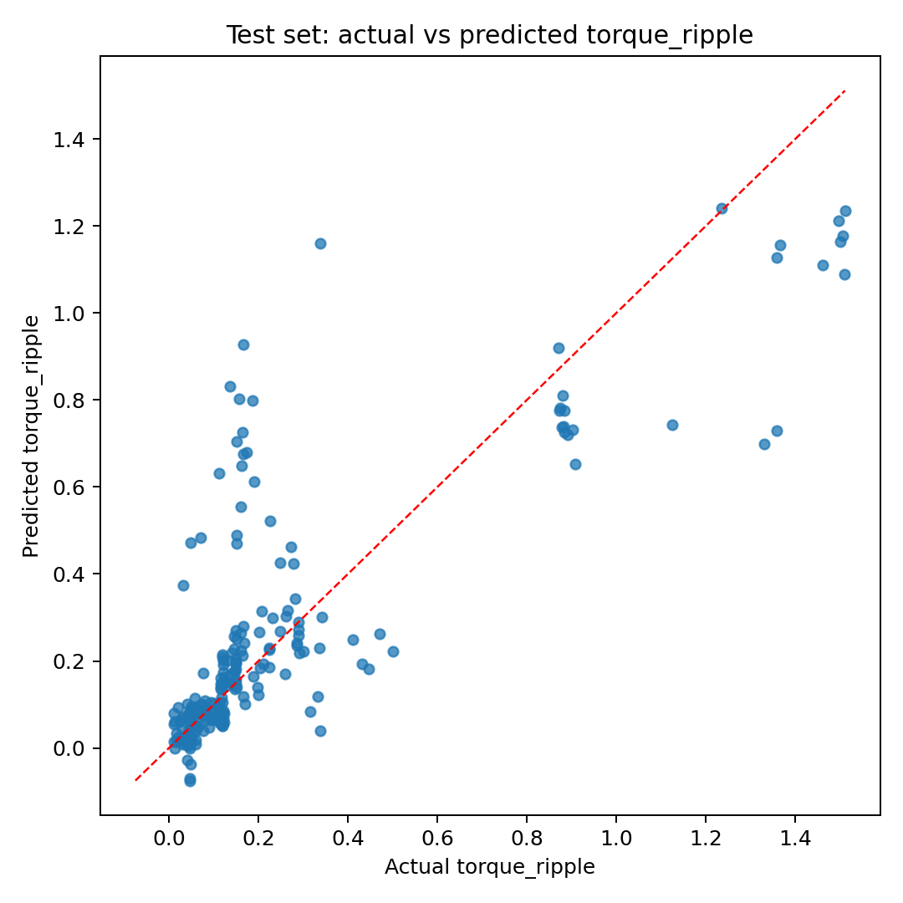

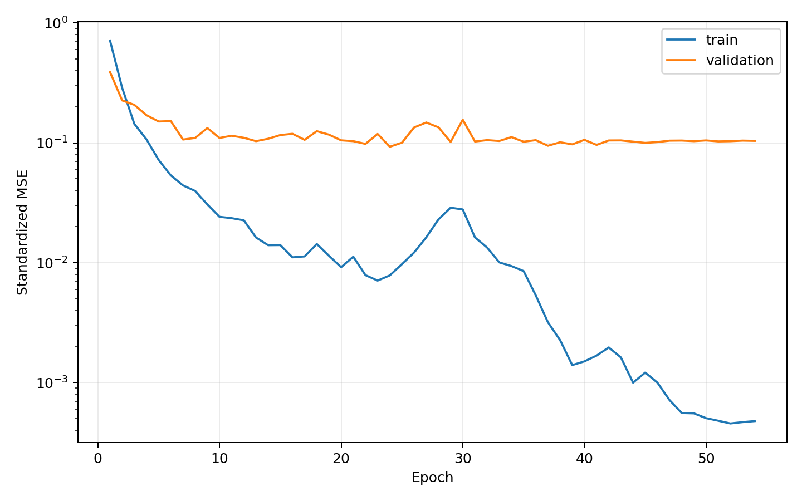

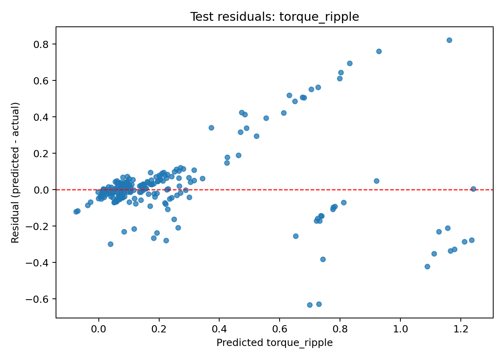

MLP 的测试结果略好于 ResNet-20，说明当前任务中每个固定网格位置本身包含较强信息。不过它缺少二维局部结构先验，对高脉动样本仍出现明显低估。

### 7.4 Small CNN

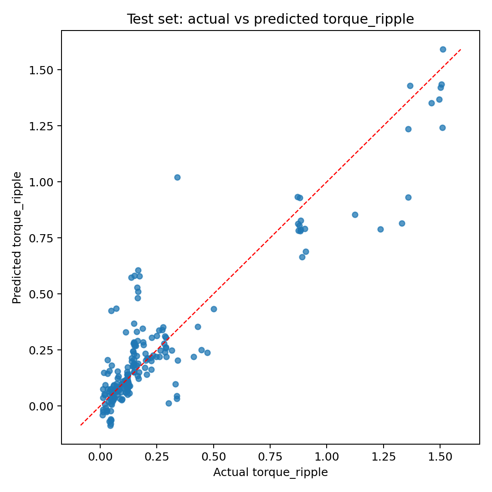

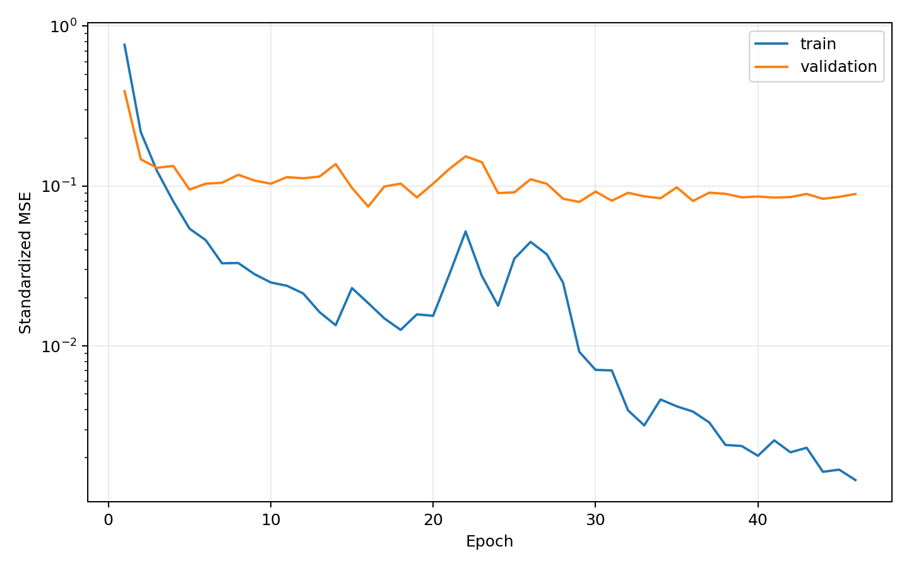

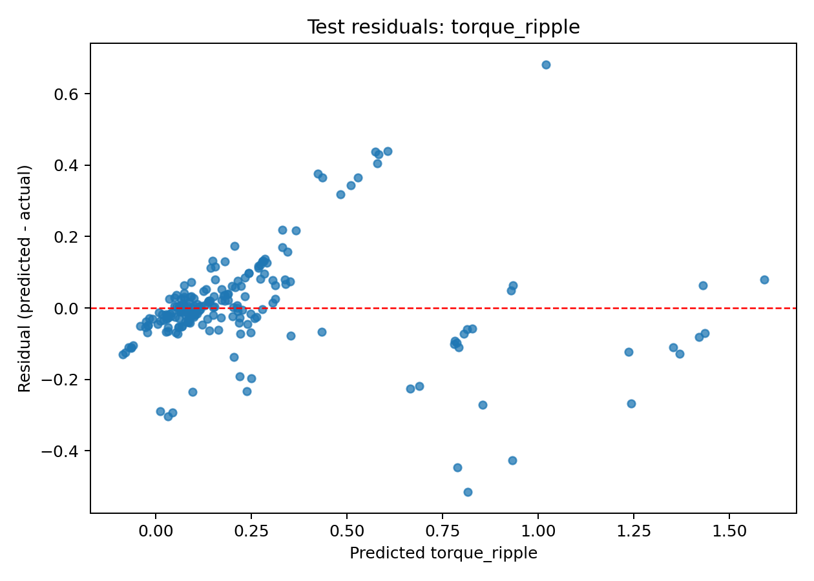

Small CNN 的散点整体最接近理想对角线，尤其在高脉动范围内比另外两个模型更稳定。它在三个模型中参数最少，却获得最高测试 R²，说明二维卷积是有效的，而当前阶段并不需要过深的残差网络。

### 7.5 Small CNN 在各适应度带的测试误差

| 适应度带 | 测试样本数 | MAE | RMSE |
|---|---:|---:|---:|
| B1 | 118 | 0.0888 | 0.1452 |
| B2 | 11 | 0.1246 | 0.1777 |
| B3 | 14 | 0.1748 | 0.2454 |
| B4 | 19 | 0.0667 | 0.0860 |
| B5 | 15 | 0.0757 | 0.0955 |
| B6 | 26 | 0.0359 | 0.0426 |
| B7 | 7 | 0.0147 | 0.0176 |

B2、B3 的误差相对较大，是后续最值得补样本和诊断的区域。B7 的绝对误差虽小，但测试样本只有 7 个，暂时不能据此得出强结论。各带内部目标范围很窄且样本量不均，因此本报告不使用“分带 R²”判断模型优劣，主要采用全测试集指标和分带 MAE/RMSE。

## 8. 如何理解三个评价指标

- **MAE**：每个样本预测误差绝对值的平均数，直观、对极端误差相对不敏感，越小越好。
- **RMSE**：先平方误差再求平均并开方，会更重地惩罚少数大误差，越小越好。
- **R²**：模型解释目标变化的比例。1 表示理想拟合，0 表示与直接预测测试集均值相当。本次 Small CNN 的测试 R² 为 0.837，表示它解释了约 83.7% 的测试集转矩脉动率方差。

## 9. 当前结果的科学边界

1. **标签采用历史六角度定义。** 0°～15°、3°步长与历史项目兼容，但六个点不一定足以捕捉真实峰谷。后续应对代表性拓扑进行更密角度扫描，量化六点脉动率与高分辨率脉动率之间的误差。
2. **数据库不是均匀随机物理空间。** 样本来自约束感知 GA/采样流程，B1 数量明显最多。模型反映的是当前采样策略覆盖到的拓扑分布。
3. **测试集隔离的是拓扑家族。** 这比简单随机拆分更严格、更接近“预测未知拓扑”的目标，但家族定义仍依赖 Hamming 距离阈值 12。
4. **少数适应度带仍然样本不足。** 特别是 B7 全库只有 28 个，分带统计的不确定性较高。
5. **当前输出只有转矩脉动率。** 若后续同时预测平均转矩，需要修改配置、重新用训练集统计量拟合多目标 scaler 并重新训练，不能把当前 checkpoint 直接当成双输出模型。
6. **代理模型不能无条件替代 FEMM。** 它适合在相同编码、几何模式和物理设置范围内快速筛选候选；超出训练分布的拓扑仍需 FEMM 校核。

## 10. 展示文件说明

本文件夹结构如下：

```text
showoutput/
└── torque_ripple/
    ├── MODEL_TRAINING_REPORT.md
    └── images/
        ├── model_metrics_comparison.png
        ├── prediction_comparison.png
        ├── split_band_distribution.png
        ├── resnet20_prediction.png
        ├── resnet20_training_curve.png
        ├── resnet20_residual.png
        ├── mlp_prediction.png
        ├── mlp_training_curve.png
        ├── mlp_residual.png
        ├── small_cnn_prediction.png
        ├── small_cnn_training_curve.png
        └── small_cnn_residual.png
```

原始可复现结果仍保存在：

```text
outputs/motor_regression_ripple_1300_rebalanced/
```

其中每个模型目录均包含最佳 PyTorch checkpoint、逐样本预测 CSV、训练历史、指标 JSON、预测图、残差图和训练曲线。数据划分、目标 scaler、训练配置与完整数据审计也保存在该结果目录中。

## 11. 汇报时可使用的一段总结

> 本阶段以1,300个完成六角度FEMM计算的唯一电机拓扑为数据，将180位离散染色体恢复为18×10材料矩阵，并把空气、铁和铜转换成三通道one-hot输入。为了避免遗传算法近亲拓扑造成数据泄漏，训练、验证和测试按照拓扑家族整体划分，同时兼顾适应度带与转矩脉动率区间的分布。我们在完全一致的划分上比较了ResNet-20、MLP和Small CNN。最终Small CNN以最少的118,049个参数取得最佳测试结果，MAE为0.0845、RMSE为0.1381、R²为0.8370，优于更深的ResNet-20。这表明二维材料布局确实包含可学习的局部结构，但当前1,300个样本更适合容量较小的卷积网络。下一步重点是补充B2/B3等误差较大的区域，并通过更密角度FEMM扫描验证六点转矩脉动率标签的精度。
