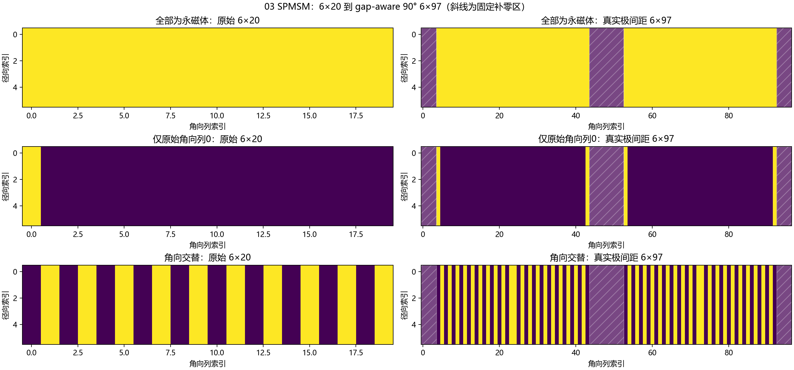
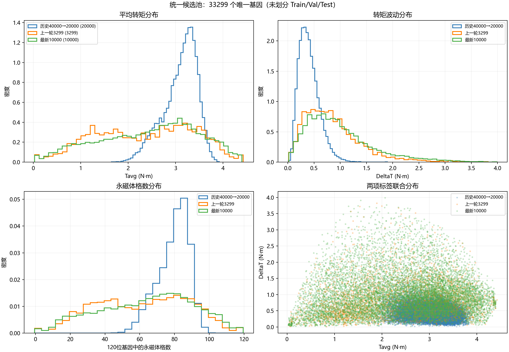
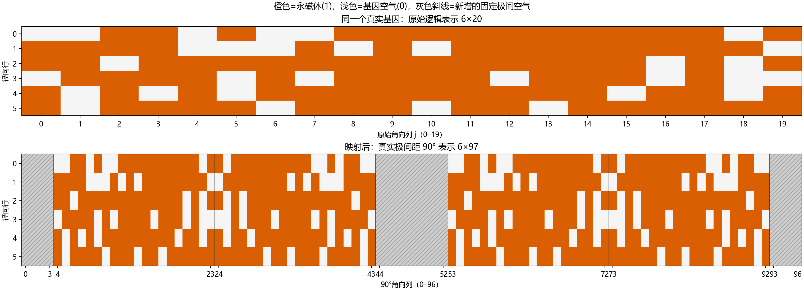

# CNN 综合对比 v3：输入表示与统一候选池

## 当前结论

- 真实极间距输入由几何推导为 **6×97**；120个独立设计变量保持不变。
- 三批数据全局去重后为 **33299 个唯一基因**。
- 标签冲突基因：**0**。
- 已按用户确认的70%/15%/15%冻结划分：训练 **23309**、验证 **4995**、测试 **4995**。
- 本阶段未训练任何CNN，也未运行FEMM。

## 1. 6×97 gap-aware 90° 推导

实际设计步长 θ = `0.930126290797°`，单极设计带宽 = `37.205051631872°`，极距 = `45.0°`。
因此单极物理间隙为 `7.794948368128°`，等价 `8.380527` 个 θ 单元；90° 等价 `96.761054` 个单元，向上取整得到 `N=97`。

四个20列设计带按真实中心角投影到97列：

- 第1带：原始列 j → `4+j`；
- 第2带：原始列 j → `43-j`；
- 第3带：原始列 j → `53+j`；
- 第4带：原始列 j → `92-j`。

固定空气补零列（0-based）为 `0–3`、`44–52`、`93–96`，共17列；四个设计带仍复制同一组120位变量，没有新增可优化变量。

## 2. 候选池来源与去重

| 来源 | 输入数量 | 与其他两批交集 | Tavg均值 (N·m) | DeltaT均值 (N·m) |
|---|---:|---:|---:|---:|
| 历史40000经F＋LCMD选出的20000 | 20000 | 0 | 3.100043 | 0.405722 |
| 上一轮3299 | 3299 | 0 | 2.348771 | 0.852508 |
| 最新10000 | 10000 | 0 | 2.436781 | 0.984031 |

三批两两交集和三批共同交集均为0，所以理论总数 `20000+3299+10000` 未减少，实际仍为 **33299**。
相同基因若出现多份标签，本流程按1e-6 N·m容差核对；超出容差会进入 `label_conflicts.csv` 并从候选池隔离。本次没有发生冲突。

U/L/B/P只表示生成来源，不解释为互斥的物理拓扑类别。最新一万原有角色仅作为来源记录保留。

## 3. 冻结数据划分

历史20000与新增13299先各自按70%/15%/15%确定身份，再合并为所有架构共用的一套划分。新增部分还按批次与U/L/B/P来源分层；固定种子和基因哈希排序保证可复现。

| 数据块 | 训练 | 验证 | 测试 |
|---|---:|---:|---:|
| 历史20000 | 14000 | 3000 | 3000 |
| 新增13299 | 9309 | 1995 | 1995 |
| 合计 | 23309 | 4995 | 4995 |

测试身份已经冻结；训练、目标归一化和检查点选择不读取测试标签。每个配置完成后只评价一次测试集。

## 4. F＋LCMD身份

历史四万的筛选使用冻结的 f1 Polar90 VGG16、F-S、12.5%新数据、第4000步无约束最佳候选；SHA256为 `9612f9892e76bc354ca6c6e885a57b29f865da8b84d0f3b67b195befc6980346`。
F为两个回归分支最终线性层之前的256维特征拼接成512维，并使用冻结参照池的分支RMS标准化。LCMD采用簇累计最近距离平方选簇，再选该簇最远成员；不是按单一距离直接取前20000。

该f1检查点没有通过当时的旧分布5%接受约束，只作为冻结特征空间使用，没有被登记为已验收预测模型。

## 5. 数据与压缩包处理

原始任务包已完成CRC、逐文件大小和路径安全核验，解出 `263` 个文件后删除两份哈希相同的本地ZIP副本；已记录原ZIP哈希。完成的10000条FEMM标签另行复制到本实验数据目录。
两份逐角度 `run_records.zip` 没有复制进v3；其标签、六角度波形、合同和校验摘要均已保留，原结果目录仍保留这两份归档。

## 6. 后续八配置

已登记且尚未训练：6×20的SmallCNN/ResNet20、6×97 gap-aware的SmallCNN/ResNet20、Polar90的VGG16/ResNet18、Polar360的VGG16/ResNet18。后续统一从头训练并共享同一套已冻结的数据身份划分。

启动入口是 `train.py`。无参数运行只执行八配置前向/反向预检；显式使用 `--train --models all` 才会顺序启动正式训练，中断后用 `--resume` 恢复。

## 范围说明

这是一轮输入表示推导和统一候选池准备。它不能证明6×97一定优于6×20，也不能在正式训练前宣称预测精度提高。
