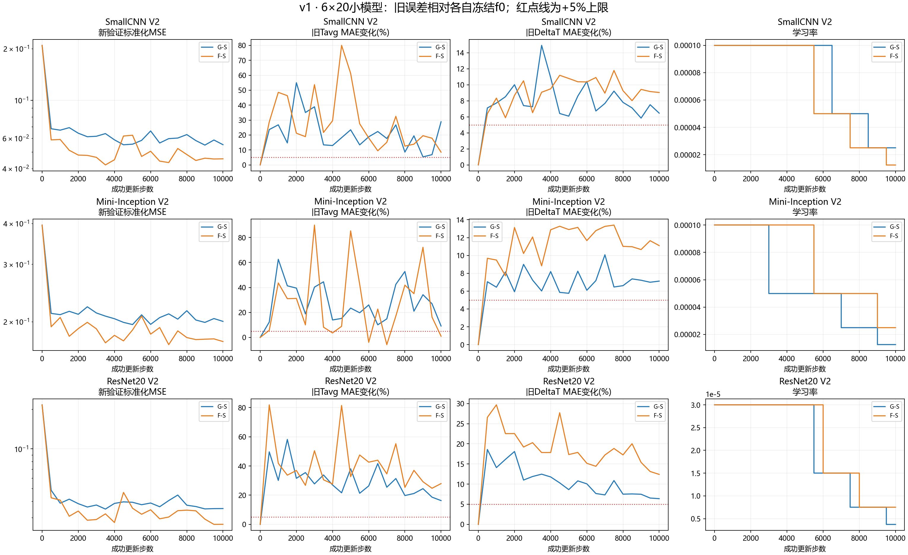
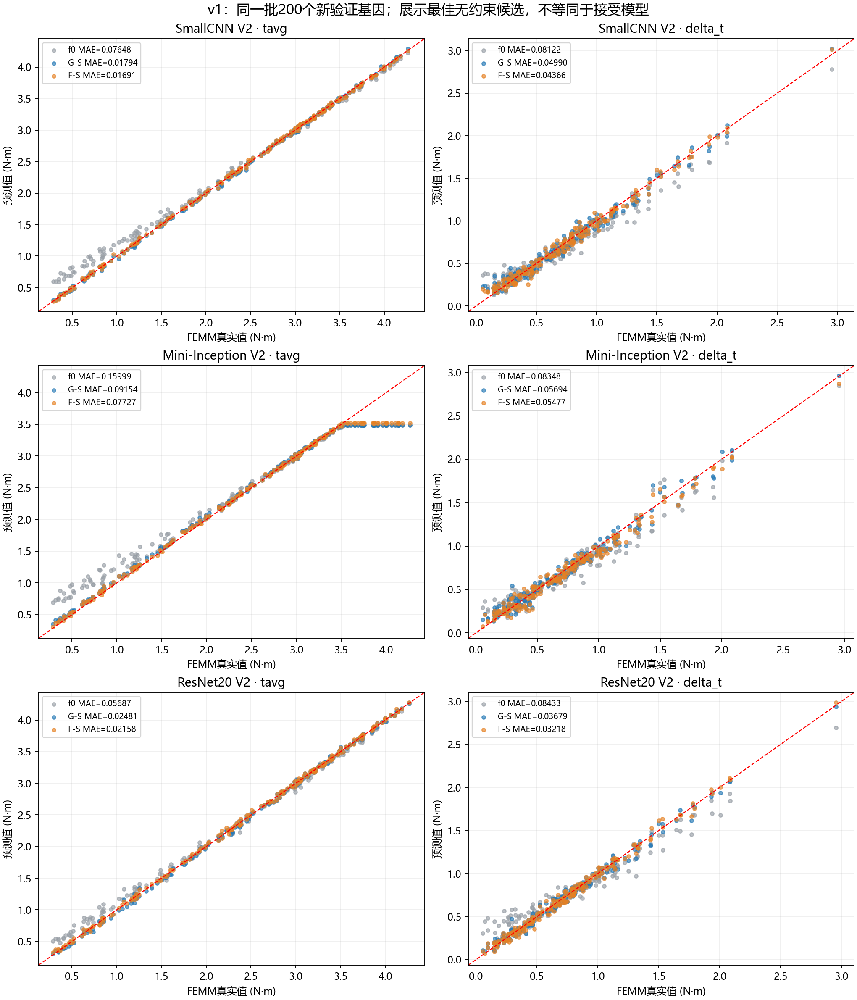

# v1：三个6×20输入模型的补样回放更新

已完成 6/6 个训练组。每个网络均使用自己的冻结原始 f0，G/F独立初始化；阈值也是相对该网络自身f0，不能与VGG16的阈值混用。

输入2×6×20（空气/永磁体one-hot），保留原BatchNorm与物理batch64。v1有效48旧+16新，固定10000步；v2有效56旧+8新，固定20000步。每版每组成功更新对应新样本抽取160000次，旧样本分别480000/1120000次；AMP重试会额外重复抽取当前批次，实际次数见预算CSV。此扩展预算不同于已完成的VGG16实验，不能把模型间差异单独归因于架构。

SmallCNN和Mini-Inception初始更新学习率1e−4；ResNet20为3e−5，均为各自原初始值的0.1倍。其他优化器/AMP/损失与选择规则沿用。每500步验证；无受约束早停。

| 网络 | 组 | 新验证最佳步数 | 最佳新MSE | 旧Tavg变化 | 旧DeltaT变化 | 接受步数 | 是否回退f0 |
|---|---|---:|---:|---:|---:|---:|---|
| SmallCNN V2 | G-S | 9000 | 0.05474 | +5.4% | +5.8% | 0 | 是 |
| SmallCNN V2 | F-S | 3500 | 0.04196 | +21.7% | +9.1% | 0 | 是 |
| Mini-Inception V2 | G-S | 5000 | 0.19595 | +23.5% | +5.8% | 0 | 是 |
| Mini-Inception V2 | F-S | 7000 | 0.17009 | -5.8% | +13.3% | 0 | 是 |
| ResNet20 V2 | G-S | 3500 | 0.03484 | +33.8% | +12.5% | 0 | 是 |
| ResNet20 V2 | F-S | 9500 | 0.02665 | +24.7% | +13.1% | 0 | 是 |

## 实际接受模型的性能

下表按实际接受路径评价：存在合格更新则使用最佳合格模型，否则明确回退自身f0。MAE单位均为N·m；这与上表的无约束候选不同。

| 网络 | 组 | 接受模型/步数 | 旧Tavg MAE（变化） | 旧DeltaT MAE（变化） | 新Tavg MAE | 新DeltaT MAE | 新标准化MSE |
|---|---|---|---:|---:|---:|---:|---:|
| SmallCNN V2 | G-S | f0（回退） | 0.00926 (+0.0%) | 0.02635 (+0.0%) | 0.07648 | 0.08122 | 0.20882 |
| SmallCNN V2 | F-S | f0（回退） | 0.00926 (+0.0%) | 0.02635 (+0.0%) | 0.07648 | 0.08122 | 0.20882 |
| Mini-Inception V2 | G-S | f0（回退） | 0.01961 (+0.0%) | 0.02885 (+0.0%) | 0.15999 | 0.08348 | 0.39526 |
| Mini-Inception V2 | F-S | f0（回退） | 0.01961 (+0.0%) | 0.02885 (+0.0%) | 0.15999 | 0.08348 | 0.39526 |
| ResNet20 V2 | G-S | f0（回退） | 0.01110 (+0.0%) | 0.01668 (+0.0%) | 0.05687 | 0.08433 | 0.21622 |
| ResNet20 V2 | F-S | f0（回退） | 0.01110 (+0.0%) | 0.01668 (+0.0%) | 0.05687 | 0.08433 | 0.21622 |

接受条件：旧两项MAE各自≤自身f0×1.05，且新标准化MSE优于自身f0；在合格节点中择新MSE最低者。没有合格更新则明确回退f0。`best_unconstrained.pt`、`best_feasible.pt`（如存在）和`last_checkpoint.pt`分别是无约束最佳、合格最佳、最终模型。完整路径见[模型登记](model_registry.json)。

完整新旧MAE、RMSE、P95以及U/L/B/P来源误差在 [validation_metrics.csv](validation_metrics.csv)；每个来源50个新验证样本。实际抽样、时间、覆盖率和学习率在 [training_budgets.csv](training_budgets.csv)。

## P来源：最佳无约束候选相对自身f0的MAE变化

| 网络 | 组 | Tavg | DeltaT |
|---|---|---:|---:|
| SmallCNN V2 | G-S | -12.7% | -9.3% |
| SmallCNN V2 | F-S | +19.9% | -5.4% |
| Mini-Inception V2 | G-S | +25.3% | -0.3% |
| Mini-Inception V2 | F-S | -18.0% | +9.6% |
| ResNet20 V2 | G-S | +2.4% | -11.2% |
| ResNet20 V2 | F-S | +4.7% | -4.9% |

这是单随机种子开发实验，新验证参与了模型选择，不能作为盲测结论，不能证明某方案稳定更好或优于随机补样。新旧测试均未解封。原VGG16配置、结果和检查点保留。

训练源码：`../update.py`；绘图与报告源码：`../report_results.py`。新数据沿用已验收划分，不复制或重算FEMM标签。
