# v2 三个6×20模型性能图

每个网络4张PNG，直接在本页显示。图中展示最佳无约束候选，不等同于最终接受模型。

前三张蓝色表示旧验证基因、橙色表示新验证基因；第四张仅看新基因，蓝色为自身f0、橙色为更新模型。

## SmallCNN V2

G-S：图中为无约束候选第 15500 步；实际接受第 11500 步。

F-S：图中为无约束候选第 9500 步；实际回退自身f0。

### 01_平均转矩_真实值与预测值

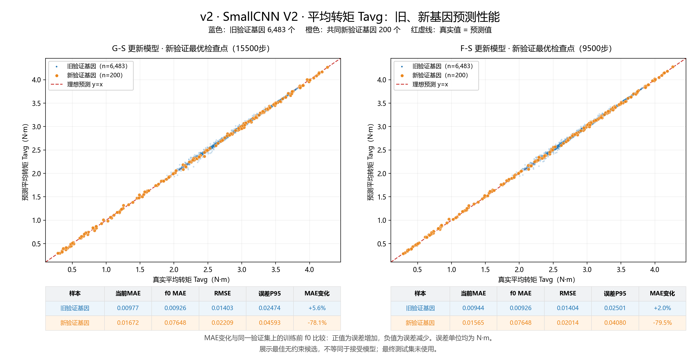

### 02_转矩波动_真实值与预测值

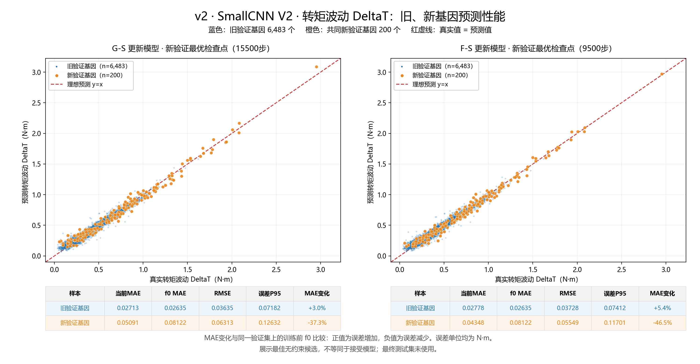

### 03_新旧基因_MAE变化

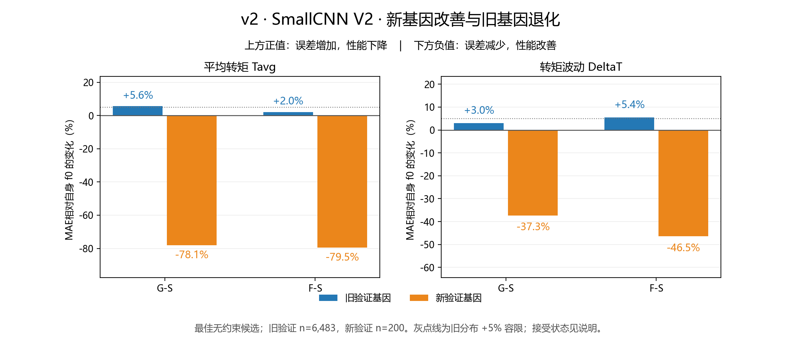

### 04_仅新基因_老模型与更新模型对比

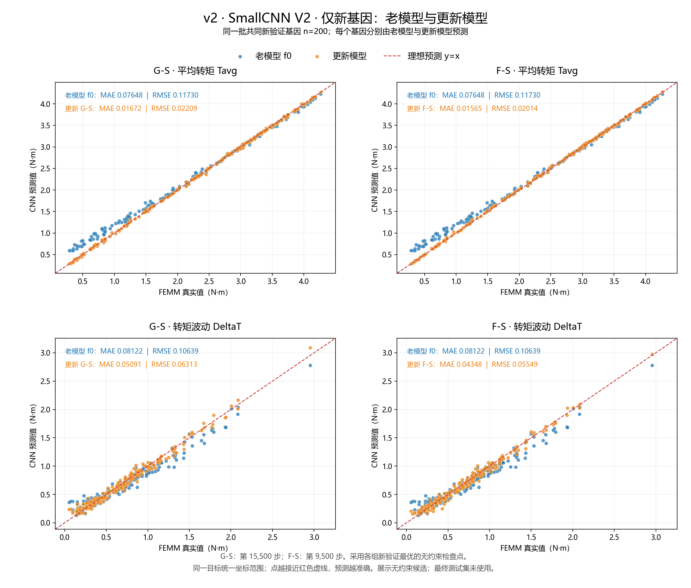

## Mini-Inception V2

G-S：图中为无约束候选第 7000 步；实际接受第 10500 步。

F-S：图中为无约束候选第 16000 步；实际回退自身f0。

### 01_平均转矩_真实值与预测值

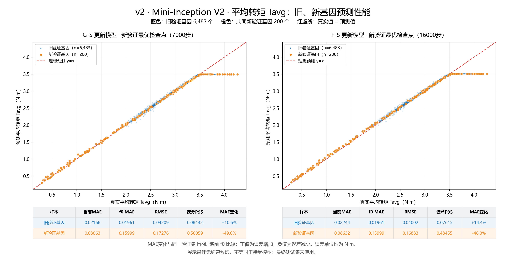

### 02_转矩波动_真实值与预测值

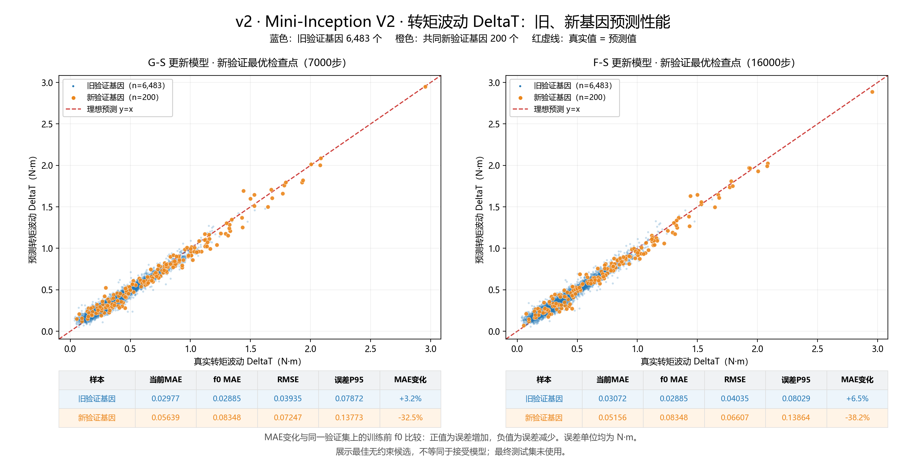

### 03_新旧基因_MAE变化

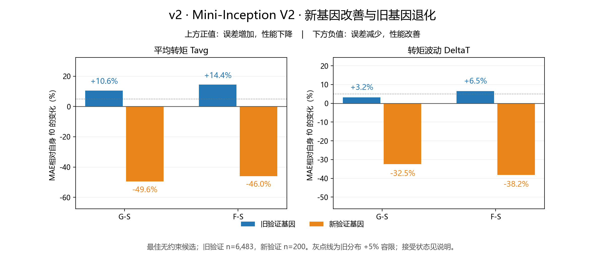

### 04_仅新基因_老模型与更新模型对比

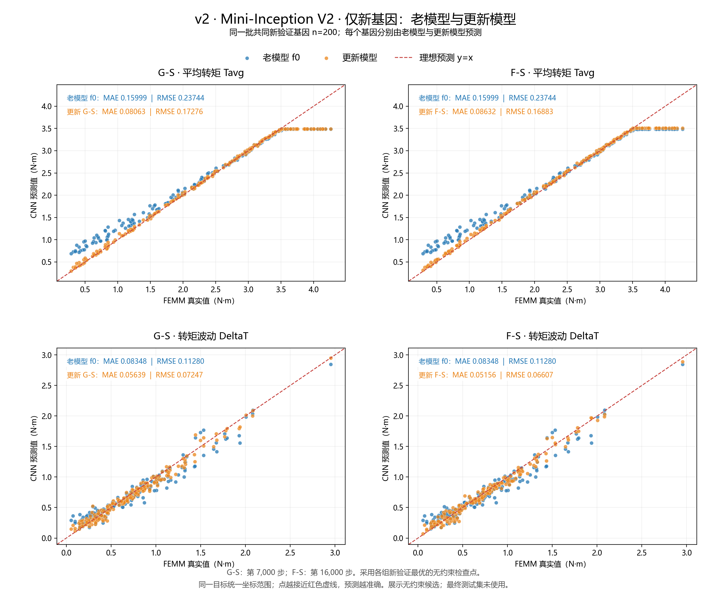

## ResNet20 V2

G-S：图中为无约束候选第 15500 步；实际回退自身f0。

F-S：图中为无约束候选第 10000 步；实际回退自身f0。

### 01_平均转矩_真实值与预测值

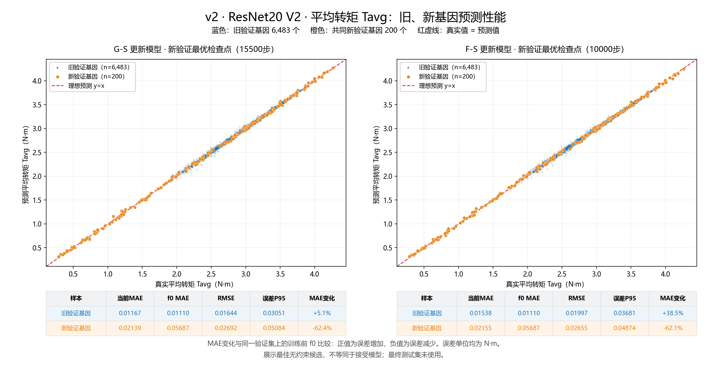

### 02_转矩波动_真实值与预测值

### 03_新旧基因_MAE变化

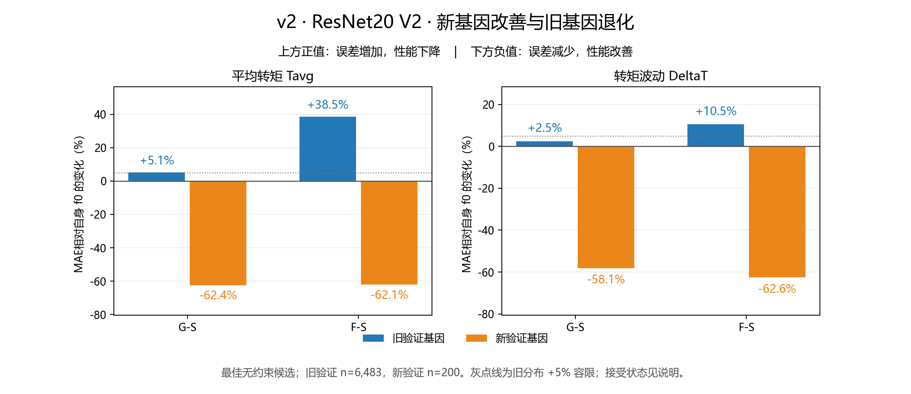

### 04_仅新基因_老模型与更新模型对比

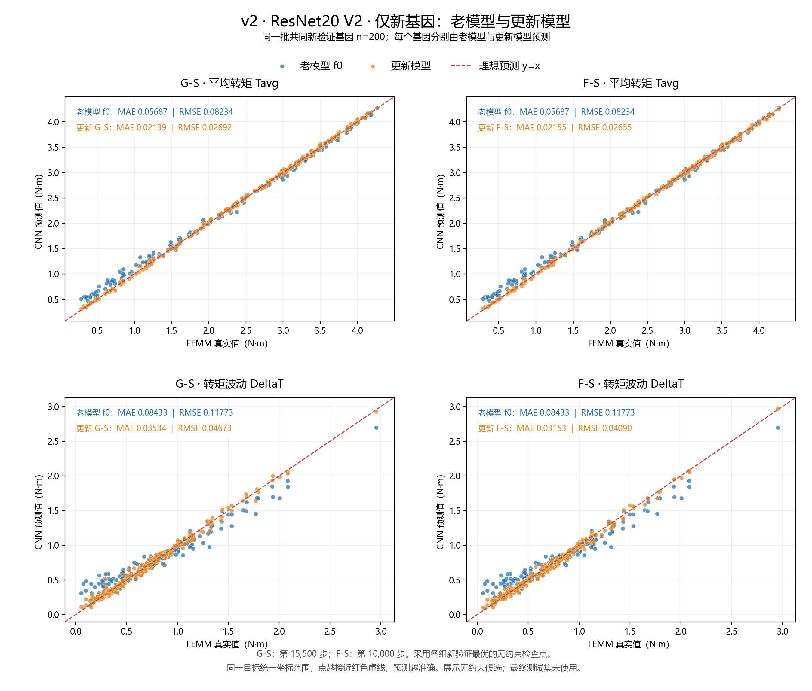

