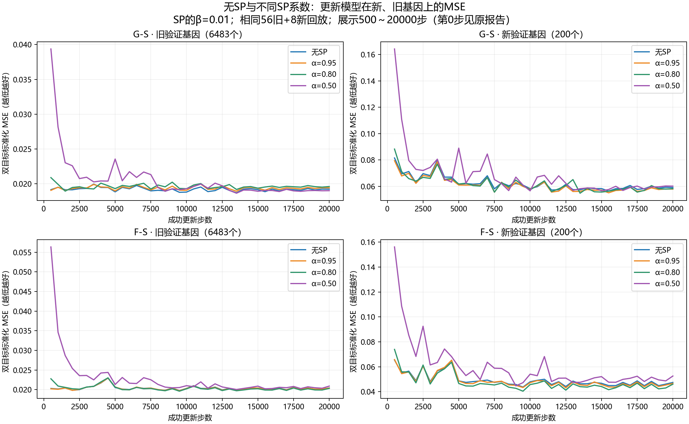
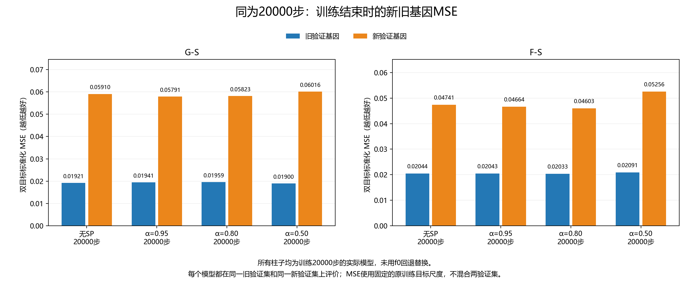
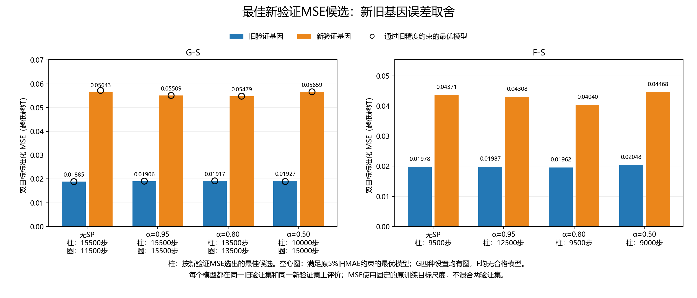

# 是否使用SP：新旧基因MSE直接比较

这里比较的每个模型都从自身同一个原始f0出发，再按56旧+8新训练。无SP为普通热启动（α=1、β=0），其余β=.01、α=.95/.80/.50。图里的“旧/新”只表示评价的验证基因，不是不同模型版本。

图中MSE均为两个目标使用固定原训练标准差归一化后的平均平方误差（无量纲），数值越低越好；没有把新旧验证集合并。各目标物理MSE=RMSE²，单位(N·m)²，另存于 `新旧基因_MSE对比.csv`。

## 先看结论

按既定新MSE＋旧两目标MAE各自不增加超过5%的规则，G组α=.80最有希望；相对无SP合格模型，新MSE降低约4.2%。α=.95也改善约3.7%。α=.50也合格，其MAE较好，但DeltaT平方误差尾部更大，新综合MSE改善约1.0%。

F组各SP设置都没有通过旧精度约束，即使新MSE较低也不能据此认定值得替换原模型。MSE图用于直接比较预测误差；原来的MAE接受规则没有被修改。

## G组：真正通过约束的模型

| 设置 | 步数 | 旧验证MSE | 新验证MSE | 新MSE相对无SP合格对照变化 |
|---|---:|---:|---:|---:|
| 无SP | 11500 | 0.018858 | 0.057208 | +0.00% |
| α=0.95 | 15500 | 0.019059 | 0.055094 | -3.69% |
| α=0.80 | 13500 | 0.019166 | 0.054793 | -4.22% |
| α=0.50 | 15000 | 0.018909 | 0.056609 | -1.05% |

## 04_新旧基因_MSE训练过程

## 05_新旧基因_MSE_最终模型

## 06_新旧基因_MSE_最佳候选与合格模型

只重绘现有验证结果，未重新训练或解封测试集。这是单种子开发比较，不能宣称SP普遍有效或系数普遍最优。
