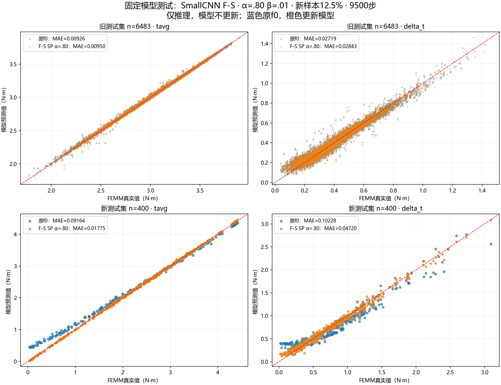

# 固定SmallCNN模型测试结果

模型在读取测试标签前已固定：F-S、α=.80、β=.01、新样本12.5%、9500步，选自6%验证容限复核。此处仅与其原始f0作同测试集比较，没有根据测试结果改模型或重新选择系数。

新测试集400个（U/L/B/P各100个），旧测试集6483个。只推理，eval模式＋inference_mode，无反向传播、无优化器更新；所有参数和BatchNorm缓冲状态前后哈希一致。checkpoint文件未改动。

## 两个模型的测试误差

误差单位为N·m。MAE变化相对原f0在同一测试集上的误差。

| 测试集 | 目标 | 原f0 MAE | 更新模型 MAE | MAE变化 | 更新模型 RMSE | 更新模型 P95 |
|---|---|---:|---:|---:|---:|---:|
| 旧 | tavg | 0.009256 | 0.009501 | +2.64% | 0.014824 | 0.026252 |
| 旧 | delta_t | 0.027190 | 0.028427 | +4.55% | 0.038397 | 0.076601 |
| 新 | tavg | 0.091642 | 0.017754 | -80.63% | 0.022295 | 0.044134 |
| 新 | delta_t | 0.102282 | 0.047204 | -53.85% | 0.061633 | 0.131536 |

| 测试集 | 原f0 标准化MSE | 更新模型标准化MSE |
|---|---:|---:|
| old_test | 0.019567 | 0.021031 |
| new_test | 0.326964 | 0.053915 |

## 新测试集分来源

| 来源 | 数量 | Tavg MAE | Tavg变化 | DeltaT MAE | DeltaT变化 |
|---|---:|---:|---:|---:|---:|
| U | 100 | 0.018466 | -87.98% | 0.043912 | -69.60% |
| L | 100 | 0.015532 | -81.08% | 0.049554 | -44.58% |
| B | 100 | 0.018260 | -82.26% | 0.048364 | -58.92% |
| P | 100 | 0.018758 | -32.95% | 0.046984 | -18.35% |

## 结果解读

在400个新测试样本上，Tavg/DeltaT MAE相对原f0变化 -80.63% / -53.85%；旧测试集对应变化 +2.64% / +4.55%。

6%是开发阶段旧验证集上的模型选择容限；测试结果用于独立展示泛化效果，不再据此改门槛或替换检查点。原始模型在历史V3阶段可能已经报告过旧测试结果，不能把这次旧测试复核说成首次盲测；400新测试集此前在补样更新/SP筛选阶段未用于预测或选择。

测试推理不会让模型记忆这些样本；但测试结果现在已被研究者看到，未来若据此继续选参数，应说明该测试集已参与开发反馈，不能再次称完全未见的盲测。

完整基线/更新模型的MAE、RMSE、P95及分来源指标见 `test_metrics.csv`。源代码、模型身份、数据哈希、预测与推理不变性验证位于 `experiments/cnn_test_smallcnn_sp080_v1/`。
