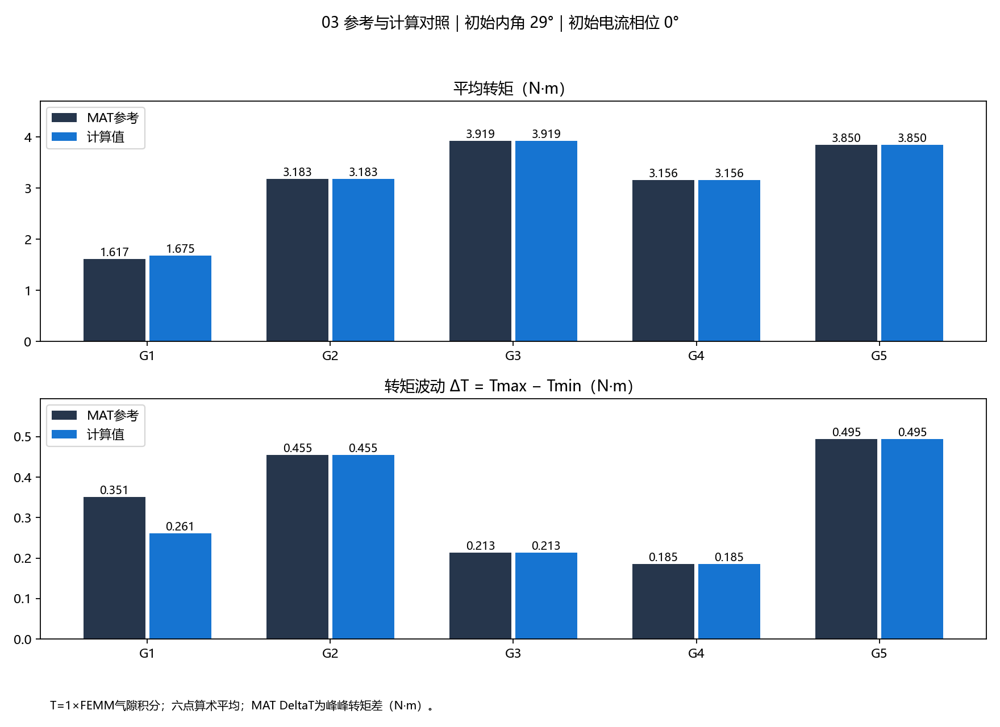
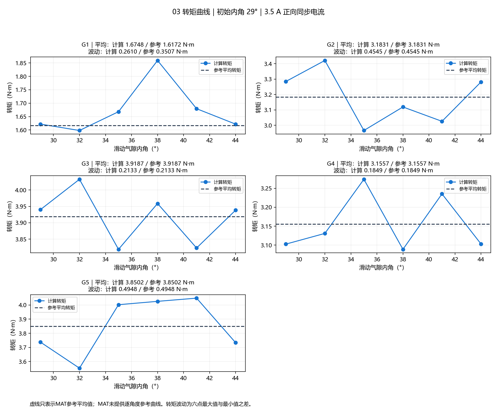

# 03：导师初始内角29°公式，五个基因复现

**30次FEMM求解全部完成。G2～G5的平均转矩和峰峰波动均与MAT参考值一致，最大绝对差约1.3×10⁻¹² N·m。G1没有复现，其初始种群记录存在磁体单元数不一致。**

没有更换这五个基因，没有重新筛选电流初相位，没有拟合转矩符号或倍率。

## 实际设置

- 初始内角：导师新提供代码中的 `ang_0=29°`。
- 机械转动量 `ANG_R`：用户指定的0、3、6、9、12、15°。
- 实际Inner Angle：29、32、35、38、41、44°；Outer Angle=0°。
- MAT直接读取：`Is_amp=3.5 A`、`F=400 Hz`、`wmech=628.3185307179587 rad/s`、`P=4`、`Lfe=36 mm`。
- 电流：`t=deg2rad(ANG_R)/wmech`，`omega=2*pi*F`；A/B/C分别采用`Is_amp*cos(omega*t)`及−2π/3、−4π/3相移。
- 电流初始电角度0°，随后为12、24、36、48、60°；29°不进入电流初始相位。
- 起始A/B/C为3.5、−1.75、−1.75 A，末点为1.75、1.75、−3.5 A。
- Min Angle=15°，Precision=1e-8，Smart Mesh=On，静磁平面模型、毫米单位、深度36 mm；材料、几何和绕组沿用原始模板。
- 原脚本的T/ANG_R生成片段未提供；此处使用用户指定采样点。四个基因的数值一致性支持这套采样与计算设置。

## 与参考值的对照

平均转矩为六点算术平均。这里MAT的`DeltaT`对应最大转矩减最小转矩，单位N·m。

| 基因 | MAT状态/行（0起始） | 参考平均/N·m | 计算平均/N·m | 参考ΔT/N·m | 计算ΔT/N·m | 结果 |
|---|---|---:|---:|---:|---:|---|
| G1 | 0 / 338 | 1.617231331464 | 1.674758900161 | 0.350748530728 | 0.260994281885 | 未对应 |
| G2 | 31 / 190 | 3.183132769850 | 3.183132769850 | 0.454533168517 | 0.454533168517 | 对应 |
| G3 | 193 / 258 | 3.918657684575 | 3.918657684575 | 0.213291589236 | 0.213291589235 | 对应 |
| G4 | 200 / 491 | 3.155745847366 | 3.155745847366 | 0.184942580550 | 0.184942580550 | 对应 |
| G5 | 200 / 33 | 3.850156660599 | 3.850156660599 | 0.494776651683 | 0.494776651683 | 对应 |

G1平均转矩相对误差3.5572%，峰峰波动相对误差25.5893%。其余四个的差值见`result_validation.json`，这是数值复现精度，不代表实物电机预测精度。

## 此次确认的两项后处理修正

1. **直接使用FEMM气隙转矩积分，不乘旧的−2。** 当前四组原始积分均值直接对应MAT。旧倍率只是先前初始位置未对齐时的经验比较尺度，不适用于本次复现；保留在`summary.json`的`legacy_minus2_comparison`，没有用于主图。
2. **MAT DeltaT为峰峰转矩差，不是相对百分比。** 当前四组的`max(T)-min(T)`逐一对应MAT；此前直接拿`(max-min)/abs(mean)`与MAT DeltaT比较的解释应纠正。相对波动仍作为派生量保留。

FEMM官方滑动气隙基准也说明，其气隙转矩积分可以根据周期模型计算整机转矩，不能照搬其他积分方法的扇区倍率；本次采用原始返回值的直接依据是四组独立数值均与参考对应。[FEMM Sliding Band Benchmark](https://www.femm.info/doku/doku.php?id=SlidingBandBenchmark)。

## G1的记录问题

- `population_all(339,:,1)`共45个1，`population_noChange_all(339,:,1)`与它完全相同。
- 同一位置的`VolumePM_all(339,1)=44`。其余四个分别为80、100、82、99，与基因计数一致。
- 进一步只读核对发现：初始状态的612条记录中有538条存在这种计数差异；后续状态没有该计数差异。
- 这支持G1属于初始种群记录对应问题的判断，但现有数据不能确定历史上哪个单元被修改，或修改发生在哪个阶段。因此没有擅自删改G1基因来追平参考值，也不能断言仅凭此项计数就已解释全部转矩差异。

详见`gene_reference_audit.json`。MATLAB索引比报告中的0起始状态/行均加1。

## 文件与核验

- 输入配置及30个模型清单：`run.json`；每个角度目录保留`model.fem`、`model.ans`、`result.json`。
- 数值结果：`summary.json`、`metrics.csv`；逐角度电流/转矩：`waveforms.csv`。
- 求解前检查：`input_validation.json`，30个模型角度、电流与网格参数通过；13项离线测试通过。
- 求解后检查：`result_validation.json`，30组FEM/ANS哈希与保存的求解记录相符，原始MAT/FEM未改动。
- FEMM求解过程中回写了浮点格式及三条圆弧记录的末列网格数值；已逐模型记录前后差异并核对，其余文本、内外角、电流及Min Angle保持设置值。
- `run.json`的配置是求解前冻结快照，其中DeltaT文字注释仍保留当时的暂定解释；`summary.json.report_definition`明确记录本次数值验证后的峰峰差定义。没有为修正报告单位而改写原始解或重新求解。

当前统一配置已更新在`../../femm_config.py`；报告重生成只读取这30组已有解，不会启动新的FEMM求解。
